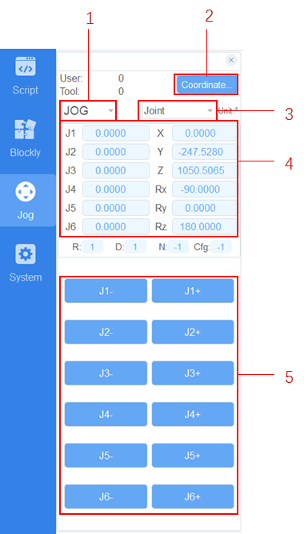

=========
Jog Panel
=========

The jog panel allows the user to move the robot without having to run a program. This enables you
to refine movements after getting close with the drag function, or to return to within the joint
limits after triggering an out of bounds error.

You can use the Jog Panel to move your robot using two methods. The first method is moving each
joint individually. The second method is moving the end effector in X, Y, Z, RX, RY, and RZ.

You can set the mode to run continuously as you hold down a button, or specify the step at which it
should move when you click on the button.

You can specify the coordinate system you would like the move the cobot relative to.

The panel will display the location of the end effector and the joint positions depending on which
coordinate system you have specified.

Operating Modes
---------------

.. list-table::
    :header-rows: 1
    :widths: 5 10 85

    * - Number
      - Name
      - Description
    * - 1
      - Step mode
      - You can select the right step in the Step mode. The step supports 0.1, 1, 5, and 10. In
        Cartesian coordinate system, the step unit is mm, and in Joint coordinate system, the step
        unit is degrees.
    * - 2
      - Coordinate system
      - According to the actual needs, the user can select one of the preset user coordinate
        systems as the current user coordinate system; similarly, select one of the preset tool
        coordinate systems as the current user coordinate system
    * - 3
      - Jogging type
      - It supports three types: Joint coordinate system, user coordinate system and tool
        coordinate system
    * - 4
      - Location data
      - Displays the current joint position and tool center position
    * - 5
      - Jogging button
      - In the Joint coordinate system: From top to bottom, jog J1, J2,…, and J6 Jog the robot in
        the Cartesian coordinate system: From top to bottom, jog the X, Y, Z, Rx, Ry, and Rz.