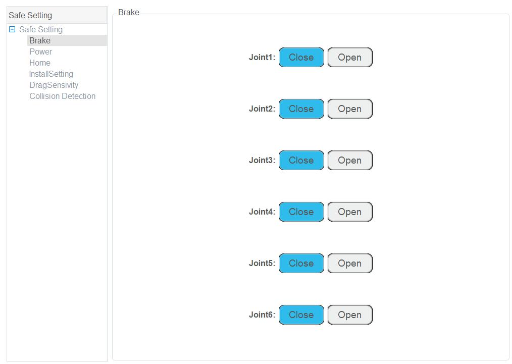

============
Safe Setting
============

Brake
-----

If you want to drag joints by hand, please enable the braking function. Namely, open each joint
brake on the **Parameter > SafeSetting > Brake** page.

.. warning::

    Deactivating a joint's brake will cause the distal linkages to fall due to gravity. Make sure
    you're holding the robot to prevent harm to the robot and to any nearby equipment.

Power
-----

When the emergency stop switch is pressed, the robot will power off. You can click **Power** on the
**Parameter > SafeSetting > Power** page to power on the robot.

Collision Detection
-------------------

Collision detection is mainly used for reducing the impact on the robot arm, and to avoid damage to
the robot arm or external equipment. If collision detection is activated, the robot arm will stop
running automatically when the robot detects that it has collided with an object.

You can enable collision detection function on the **Parameter > SafeSetting > Collision
Detection** page and set the collision level. You can also enable the **Automatically start
dragging after collision** option. This will allow you to drag the robot to a safe position after
it collides with an obstacle.

There are five levels to select. The higher the level, the higher the sensitivity to collisions.

.. image:: _images/collisiondetection.jpg
    :align: center

Electronic Skin
---------------

Electronic skin allows robot to respond in real time when robot meets an obstacle, helping the
robot avoid obstacles during operation.

You can enable electronic skin function on the **Parameter > SafeSetting > Electronic Skin** page
and set the robot status when meeting an obstacle. For example, the robot can avoid the obstacle or
stop running. You can also set the electronic skin parameters on this page.

.. list-table::

    * - +------------------------+----------------------------------------------------+
        | Parameter              | Description                                        |
        +========================+====================================================+
        | Avoid Velocity         | Avoidance velocity when meeting obstacles          |
        |                        |                                                    |
        |                        | Unit: mm/s                                         |
        |                        |                                                    |
        |                        | Value range: 1~500. Recommended value: 100         |
        +------------------------+----------------------------------------------------+
        | Avoid Distance         | Avoidance distance                                 |
        |                        |                                                    |
        |                        | Unit: mm                                           |
        |                        |                                                    |
        |                        | Value range: 0~200. Recommended value: 80          |
        +------------------------+----------------------------------------------------+
        | Avoid Acceleration     | Avoidance acceleration when meeting obstacles      |
        |                        |                                                    |
        |                        | Unit: mm/s2                                        |
        |                        |                                                    |
        |                        | Value range: 1~50000. Recommended value: 1000      |
        +------------------------+----------------------------------------------------+
        | Resume Velocity        | Recovery velocity after bypassing obstacles        |
        |                        |                                                    |
        |                        | Unit: mm/s                                         |
        |                        |                                                    |
        |                        | Value range: 1~500. Recommended value: 100         |
        +------------------------+----------------------------------------------------+
        | Resume Acceleration    | Recovery acceleration after bypassing obstacles    |
        |                        |                                                    |
        |                        | Unit: mm/s2                                        |
        |                        |                                                    |
        |                        | Value range: 1~50000. Recommended value: 1000      |
        +------------------------+----------------------------------------------------+

      - .. image:: _images/electronicskin.jpg
            :align: center

Home
----

After some parts (motors, reduction gear units) of the robot have been replaced or the robot has
been hit, the origin of the robot will be changed. You need to reset the origin. Put the robot in
the original position where the keyways of the adjacent joints are aligned, enable robot motor, and
click the **0** button.

.. note::

    Your authority level must be Administrator to perform this operation.

.. image:: _images/homing.jpg
    :align: center

InstallSetting
--------------

If the robot is ceiling mounted, wall mounted or mounted at an angle, you need to set the rotation
angle and slop angle while the robot is in its disabled state.

- **Slop angle**: Angle that robot rotates counterclockwise around X-axis at the origin point.
- **Rotation angle**: Angle that robot rotates counterclockwise around Z-axis at the origin point.

.. image:: _images/installsetting.jpg
    :align: center

DragSensitivity
---------------
The Drag Sensitivity parameters are used to adjust the sensitivity of the joints of the robot arm
during running or dragging. You can set these parameters on the **Parameter > SafeSetting >
DragSensitivity** page, and click **Save**, as shown in the image below.

.. image:: _images/dragsensitivity.png
    :align: center
