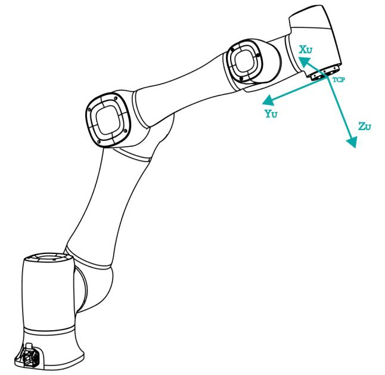
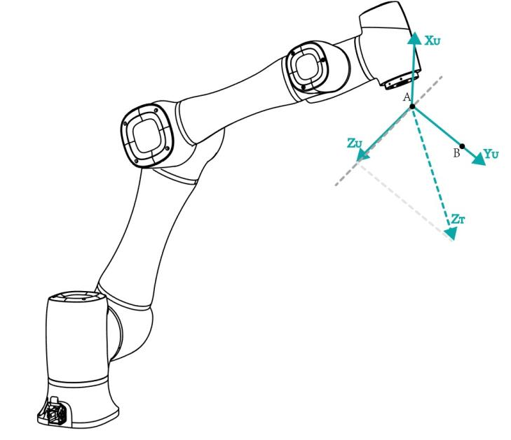

==============================
Setting User Coordinate System
==============================

When the position of workpiece is changed or a robot program needs to be reused in multiple
processing systems of the same type, you can create coordinate systems on the workpiece to simplify
programming. There are 10 groups of User coordinate systems available, of which the first one is
defined as the Base coordinate system by default and cannot be changed. And the others can be
customized by users.

.. note::

    When creating a User coordinate system, make sure that the reference coordinate system is the
    predefined Base coordinate system. Namely, the User coordinate system icon should be ``User:
    0`` when creating a User coordinate system.

- **Point**: move to any point **A** to create the origin, and create a user coordinate system
  according to the robot's default tool coordinate system.

- **Line**: Confirm a straight line between any two points **A** and **B**. The direction from
  **A** to **B** is defined as the positive direction of Y-axis, the Z-axis of Tool coordinate
  system of which point **A** is the origin is projected into the vertical plane that confirmed by
  points **A** and point **B**, we can define it as the positive direction of Z-axis. and then the
  positive direction X-axis can be defined based on the `right-hand rule`_.

- **Area**: User coordinate system is created by a three-point calibration method. Move the robot
  to three points **A(x1, y1, z1)**, **B(x2, y2, z2)**, and **C(x3, y3, z3)**. Point **A** is
  defined as the origin. The line from point **A** to point **B** is defined as the positive
  direction of X-axis. The line that point **C** is perpendicular to the X-axis is defined as the
  position direction of Y-axis. The Z-axis is defined based on the `right-hand rule`_.

.. _`right-hand rule`: https://en.wikipedia.org/wiki/Right-hand_rule

**Prerequisites**

- The robot has been powered on.
- The robot motor has been enabled.
- The robot is in the Cartesian coordinate system.

**Procedure**

1.  Click **Parameter > GlobalCoordinate > User CoorSys**. The **Coordinate User** page will be
    displayed, as shown below.

.. image:: _images/usercoordinatepage.png
  :align: center

.. note::

  **Rx**, **Ry**, **Rz** are the orientation data, which are designated by rotating the TCP around
  the X, Y, Z axes under the selected User coordinate system.

2.  Jog the robot to the first point, the click **Get First Point** on the **P1** tab to obtain the
    coordinates of the first point.

3.  Jog the robot to the second point, the click **Get Second Point** on the **P2** tab to obtain
    the coordinates of the second point.

4.  Jog the robot to the third point, the click **Get Third Point** on the **P3** tab to obtain the
    coordinates of the third point.

5.  Click **Add** and **Save** to generate the User 2 coordinate system.

6.  Select the **User: 2** coordinate system for teaching and programming.
