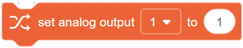

=======
Blockly
=======

The Blockly section of DobotSCStudio allows you to quickly and conveniently program your robot
using the Blockly/Scratch block-based visual programming language.

**Prerequisites**:

- The robot has been powered on

**Procedure**:

1.  Press the page with the plus icon to start a new project.
2.  Drag the blocks to the code area to start programming.

   -    Set the corresponding parameters of each block according to actual needs. For the
        description of blocks, please refer to `Blockly User Manual (CR Robot)`_.
   -    In the point page, you can save teaching point that can be called when writing a program.

.. _`Blockly User Manual (CR Robot)`: https://www.trossenrobotics.com/Shared/DOBOT/CR_Blockly_Guide.pdf

3.  Save the project, naming it if saving for the first time.

4.  Enable the robot arm.

Blockly Commands
----------------

.. contents:: Commands
    :local:
    :depth: 2

Motion Commands
~~~~~~~~~~~~~~~

**Line Move**

.. image:: _images/blockly_linemove.png

Description: Move from the current position to a target position in straight line mode

Parameters:

-   ``TargetPoint`` - Indicate target point, which is obtained from the TeachPoint page

Returns: None

**Joint Move**

Description: Move from the current position to a target position in point to point mode

Parameters: Indicate the joint angle of the target position, the joint angles is set by Joint data command,

Returns: None

**Coordinate Move**

.. image:: _images/blockly_coordmove.png

Description: Move from the current position to a target position in point to point mode

Parameters:

-   ``TargetPoint`` - Indicate target point, which is obtained from the TeachPoint page

Returns: None

**Line Offset Move**

.. image:: _images/blockly_lineoffsetmove.png

Description: Move the corresponding offset in X, Y and Z directions from the
current position in straight line mode

Parameters:

    ``X`` - Indicate offset of X axis
    ``Y`` - Indicate offset of Y axis
    ``Z`` - Indicate offset of Z axis

Returns: None

**Joint Offset Move**

.. image:: _images/blockly_jointoffsetmove.png

Description: Move the joint offset in each axis from the current position in the Joint coordinate system

Parameters:

-   ``joint 1 - joint 6`` - Indicate angular offset of J1 - J6 axes

Returns: None

**Coordinate Offset Move**

.. image:: _images/blockly_coordoffsetmove.png

Description: Move the joint offset in each axis from the current position in point to point mode

Parameters:

    ``X`` - Indicate coordinate offset of the X axis
    ``Y`` - Indicate coordinate offset of the Y axis
    ``Z`` - Indicate coordinate offset of the Z axis

Returns: None

**Arc**

Description: Move from the current position to a target position in an arc interpolated mode

Parameters:

-   ``point1`` - Indicate the arc's middle point, obtained from the TeachPoint page
-   ``point2`` - Indicate the arc's end point, obtained from the TeachPoint page

Returns: None

**Circle**

Description: Move from the current position to a target position in a circular interpolated mode

Parameters:

-   ``point1`` - Indicate the circle's middle point, obtained from the TeachPoint page
-   ``point2`` - Indicate the circle's end point, obtained from the TeachPoint page
-   ``count`` - number of whole circles, value range: 1 - 999

Returns: None

**Joint Data**

Description: Set the joint angle

Parameters:

-   ``joint 1 - joint 6`` - Indicate joint angle of J1 - J6 axes

Returns: None

**Get Current Joint Data**

Description: Get the current position of the robot joints

Parameters: None

Returns: Joint angle of J1 - J6 axes

**Get Current Coordinate Data**

Description: Get the current pose of the robot

Parameters: None

Returns: Cartesian coordinates of the current pose

I/O Commands
~~~~~~~~~~~~

**Set Digital Output**

.. image:: _images/blockly_setdo.png

Description: Set the status of a digital output port

Parameters:

-   ``Control end`` - controller or tool
-   ``DO`` - Digital output index. When you select controller, the value range is DO1 - DO16; when you select tool, the value range is DO1 - DO2
-   ``Status`` - set the DO to on or off

Returns: None

**Wait Digital Input**

Description: If any of the following conditions are met, the program continues to execute:
- The status of DI is the same as the status set by the instruction
- The status of DI is different from the state set by the instruction, while the waiting time exceeds the preset time

Parameters:

-   ``Control end`` - controller or tool
-   ``DI`` - digital input index. When you select controller, the value range is DI1 - DI32; when you select tool, the value range is DI1 - DI2
-   ``Status`` - Indicate status of DI
-   ``Time`` - Set the waiting time, if the waiting time value is 0, it will wait until the condition is met

Returns:

**Set Analog Output**

Description: Set the value of analog output port

Parameters:

-   ``Port`` - analog output index
-   ``Parameters`` - the value of the analog output

Returns: None

**Digital Input**

.. image:: _images/blockly_setdi.png

Description: Get the current I/O status, can be used as a conditional in certain instructions

Parameters:

-   ``Control end`` - controller or tool
-   ``DI`` - digital input index. When you select controller, the value range is DI1 - DI32; when you select tool, the value range is DI1 - DI2
-   ``Status`` - indicate status of DI
-   ``Time`` - set the waiting time, if the waiting time value is 0, it will wait forever until the condition is met

Returns: Whether the condition is True or False

**Get Analog Input**

Description: Get the value of analog input port

Parameters:

-   ``Control end`` - controller or tool
-   ``DI`` - analog input index

Returns: value of analog input port

Modbus Commands
~~~~~~~~~~~~~~~

**Get Input Register Address**

.. image:: _images/blockly_getinputreg.png

Description: Read the input register value with the specified data type from the Modbus slave

Parameters:

-   ``Address`` - Starting address of the input registers. Value range: 0 - 4095
-   ``type`` - Data type

    -   ``Empty`` - Read 16-bit unsigned integer (two bytes, occupy one register)
    -   ``“U16”`` - Read 16-bit unsigned integer (two bytes, occupy one register)
    -   ``“U32”`` - Read 32-bit unsigned integer (four bytes, occupy two registers)
    -   ``“F32”`` - Read 32-bit single-precision floating-point number (four bytes, occupy two registers)
    -   ``“F64”`` - Read 64-bit double-precision floating-point number (eight bytes, occupy four registers)

Returns: input register value

**Get Holding Register Address**

Description: Read the holding register value from the Modbus slave according to the specified data type

Parameters:

-   ``Address`` - starting address of the holding registers. Value range: 0 - 4095
-   ``type`` - Data type

    -   ``Empty`` - Read 16-bit unsigned integer (two bytes, occupy one register)
    -   ``“U16”`` - Read 16-bit unsigned integer (two bytes, occupy one register)
    -   ``“U32”`` - Read 32-bit unsigned integer (four bytes, occupy two registers)
    -   ``“F32”`` - Read 32-bit single-precision floating-point number (four bytes, occupy two registers)
    -   ``“F64”`` - Read 64-bit double-precision floating-point number (eight bytes, occupy four registers)

Returns: holding register value

**Get Discrete Input Register Address**

.. image:: _images/blockly_getdiscreg.png

Description: Read the discrete input register value from Modbus slave

Parameters:

-   ``Address`` - starting address of the discrete inputs register. Value range: 0-4095

Returns: discrete input register value

**Get Coils Register Address**

.. image:: _images/blockly_getcoils.png

Description: Read the coil register value from the Modbus slave

Parameters:

-   ``Address`` - starting address of the coils register.. Value range: 0-4095

Returns: coil register value

**Set Coils Register Address**

.. image:: _images/blockly_setcoils.png

Description: Set the coil register in the Modbus slave

Parameters:

-   ``Address`` - Starting address of the coils register. Value range: 6 - 4095
-   ``Value`` - the value written into the coil register

Returns: None

.. note::

    This command is not supported when the coil register address is from 0 to 5

**Set Holding Register Address**

.. image:: _images/blockly_setholdreg.png

Description: Set the holding register value in the Modbus slave

Parameters:

-   ``Address`` - Starting address of the holding registers to set. Value range: 0 - 4095
-   ``type`` - Data type

    -   ``Empty`` - Read 16-bit unsigned integer (two bytes, occupy one register)
    -   ``“U16”`` - Set 16-bit unsigned integer (two bytes, occupy one register)
    -   ``“U32”`` - Set 32-bit unsigned integer (four bytes, occupy two registers)
    -   ``“F32”`` - Set 32-bit single-precision floating-point number (four bytes, occupy two registers)
    -   ``“F64”`` - Set 64-bit double-precision floating-point number (eight bytes, occupy four registers)

Returns: None

TCP Commands
~~~~~~~~~~~~

**Open Socket**

.. image:: _images/blockly_opensocket.png

Description: Create a TCP network with the robot as a client

Parameters:

-   ``IP`` - IP address of the server
-   ``port`` - port of the server

Returns: None

**Get Open Socket Result**

Description: Get the connection result

Parameters: None

Returns:

-   ``0`` - TCP connection is successful
-   ``1`` - Input parameters are incorrect
-   ``2`` - Socket object is not found
-   ``3`` - Timeout setting is incorrect
-   ``4`` - If the robot is set as a client, it indicates that the connection is wrong. If the robot is set as a server, it indicates that receiving data is wrong

**Create Socket**

Description: Create a TCP network, robot as a server

Parameters:

-   ``IP`` - address of the server
-   ``port`` - Server port

Returns:

.. note::

  The port cannot be set to 502 and 8080. Otherwise, it will be in conflict with the Modbus
  default port or the port used in the conveyor tracking application, causing the creation to fail

**Get Create Socket Result**

.. image:: _images/blockly_createsocketres.png

Description: Get the connection result

Parameters: None

Returns:

-   ``0`` - TCP network created successfully
-   ``1`` - TCP network creation failed
-   ``Socket`` - Socket object

**Socket Send Variable**

Description: Send data through socket communication

Parameters: Variable: data to be sent

Returns: None

**Close Socket**

Description: Release a TCP network

Parameters: None

Returns: None

**Get Socket Send Result**

Description: Get the result of the data communication through the Socket

Parameters: None

Returns:

-   ``0`` - Sending data succeeded
-   ``1`` - Sending data failed

**Get Variable**

.. image:: _images/blockly_getsocketvar.png

Description: Obtain data through Socket communication

Parameters:

-   ``Type`` - string or number
-   ``Name`` - Variable used to hold data
-   ``waiting`` - time: Set the waiting time, if the waiting time value is 0, it will wait forever until data is received

Returns: None

Variables Commands
~~~~~~~~~~~~~~~~~~

**Make a Variable**

.. image:: _images/blockly_makevar.png

Description: Make a variable

Parameters:

-   ``Variable Name`` - Name of the variable to be created.

Returns: Defined Variable

.. note::

  You must start with a letter, and you can't use special characters like spaces in variable names

**Set Variable**

.. image:: _images/blockly_setvar.png

Description: Set the value of a variable

Parameters:

-   ``Name`` - name of the variable to be set
-   ``parameter`` - value of a variable

Returns: None

**Change Variable**

Description: Modify the value of a variable

Parameters:

-   ``Name`` - name of the variable to be changed
-   ``parameter`` - The value of an increase or decrease

Returns: None
