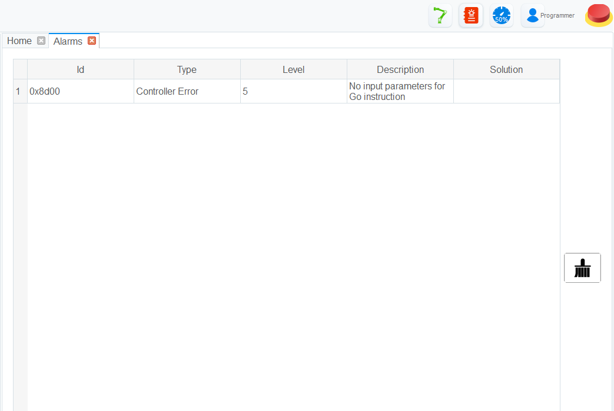

===========
Control Bar
===========

The control bar at the top right of the application contains the most important ways on controlling
your cobot. It consists of a series of buttons that interact with critical functions on your cobot.

.. contents:: Contents
    :local:
    :depth: 2

Enable/Disable Cobot
--------------------

This button displays the enabled state of the robot. When the button is green, the cobot is
`enabled` and can be controlled. When the button is red, the cobot is `disabled` and must be
enabled before it is able to be controlled.

When the button is pressed to enable the cobot, you will be presented with the `Point Load
Specification Menu`_ asking you to specify the point load of your end effector or workpiece. Once
you have filled out all fields of the menu and pressed **OK**, the robot will startup and move
around a bit, finally settling in a static state, and the button will be green, indicating that the
robot is now in its `enabled` state.

Point Load Specification Menu
-----------------------------

This menu asks you to fill out the mass and X, Y, and Z center of mass of the end effector or
workpiece. This is just a check to make sure that the load carried by the cobot will be within its
rating. If you enter a load higher than it is rated to handle, it will error out. If you enter a
load within its rating, it will continue its startup routine.

Alarms
------

This button brings a menu that displays any active alarms, a description, and potential solutions.
Once you have solved the issue that caused the alarms, press the **clear** button to re-enable your
cobot.

The button will blink red if there is an active alarm.

Speed Ratio
-----------

This button brings up a menu where you can specify the global speed ratio for the cobot.
Calculating the actual speed during various modes of operation is as follows:

.. code-block:: text

    Actual Jogging Velocity      = Max Jogging Velocity      * Global Velocity Rate
    Actual Jogging Acceleration  = Max Jogging Acceleration  * Global Velocity Rate
    Actual Playback Velocity     = Max Playback Velocity     * Global Velocity Rate * Velocity Function Velocity Rate
    Actual Playback Acceleration = Max Playback Acceleration * Global Velocity Rate * Acceleration Function Acceleration Rate
    Actual Playback Jerk         = Max Playback Jerk         * Global Velocity Rate * Jerk Function Acceleration Rate

.. image:: _images/globalvelocity.png
    :align: center

Authority
---------

Allows you to specify the authority and permissions that the active user should have. These levels
and their permissions are below:

-   **Watcher**: check the system status, I/O status, robot pose, and alarms
-   **Operator**: Operate a robot based on the existing scripts without programming
-   **Programmer**: On the basis of operator authority, you can program and teach
-   **Manager**: On the basis of programmer authority, you can set or modify parameters

The default password for all roles is ``admin`` or ``000000``. This can be modified in the
``ToolConfig > BasicConfig > UserMode`` menu when the authority is set to **Manager**.

Emergency Stop
--------------

In an emergency, press and hold this button. This will stop and power down all motors and an
emergency brake will be activated.
