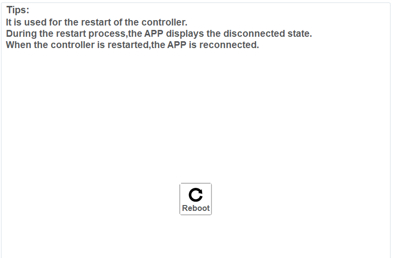
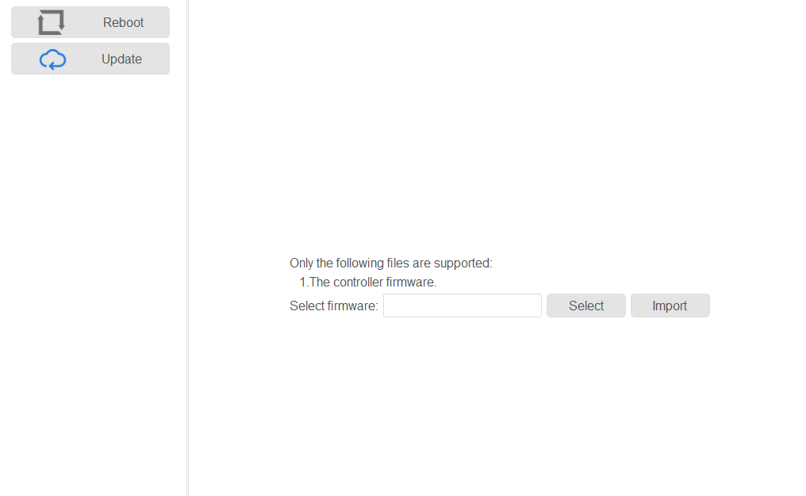

==================
Controller Setting
==================

Reboot
~~~~~~

When the controller firmware has been updated or the controller is abnormal, you need to reboot the
controller. To do this, press the **Reboot** button in this menu.

Update
~~~~~~

When the controller firmware needs to be updated, you can import the latest firmware on this page.
After importing the firmware, please reboot the controller. Please contact a Dobot support engineer
to obtain the latest firmware.

