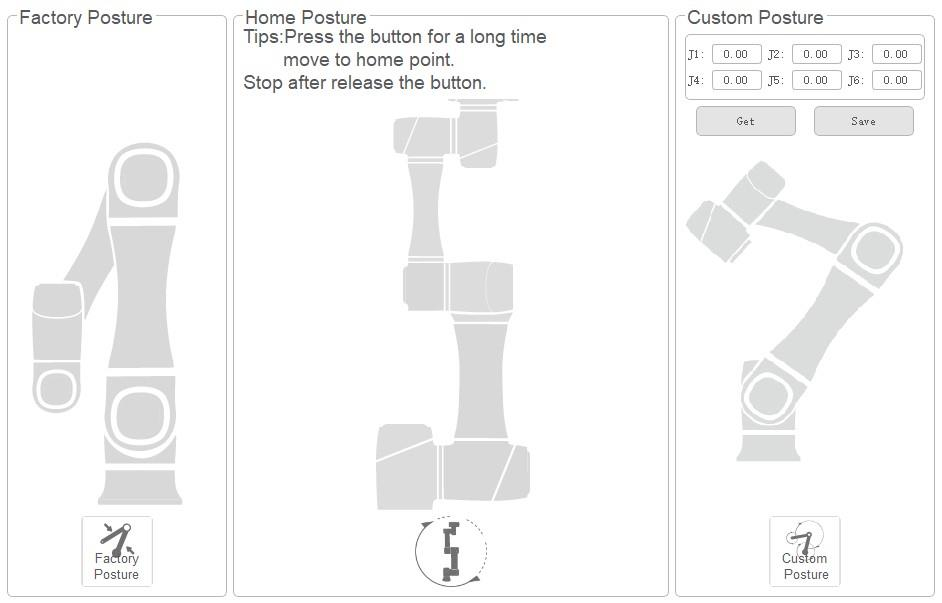

==========
Home Point
==========

DobotSCStudio supports moving the cobot to common points:

- **Factory Posture**: The posture in which you received the cobot. This posture reduces the cobot
  space, making it easy to pack and transport.
- **Home Posture**: The posture in which all joints are at their zero position. In this posture,
  the robot will be completely vertical if mounted on a horizontal surface.
- **Custom Posture**: A posture that is user-defined, making it easy to go back to a point that you
  commonly have the cobot in.

To move to any of these postures, simply hold down the button for the desired posture.

