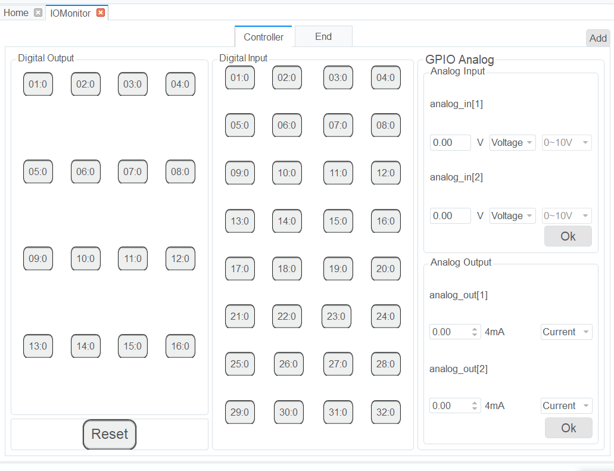

===========
I/O Monitor
===========

This menu allows the user to set and monitor the status of the controller's I/O ports. There are
three features:

- **Output**: Set digital or analog output.
- **Monitor**: Check the status of all inputs and outputs. The status of output ports cannot be
  modified.
- **Simulation**: Simulate the analog input for debugging and running the program.

