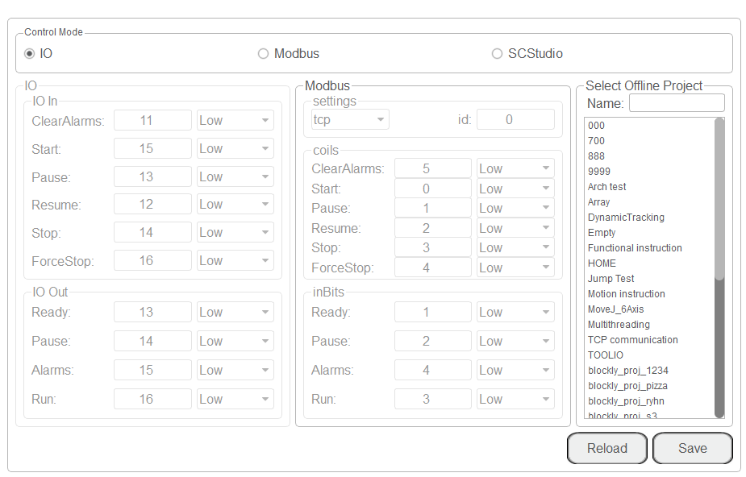
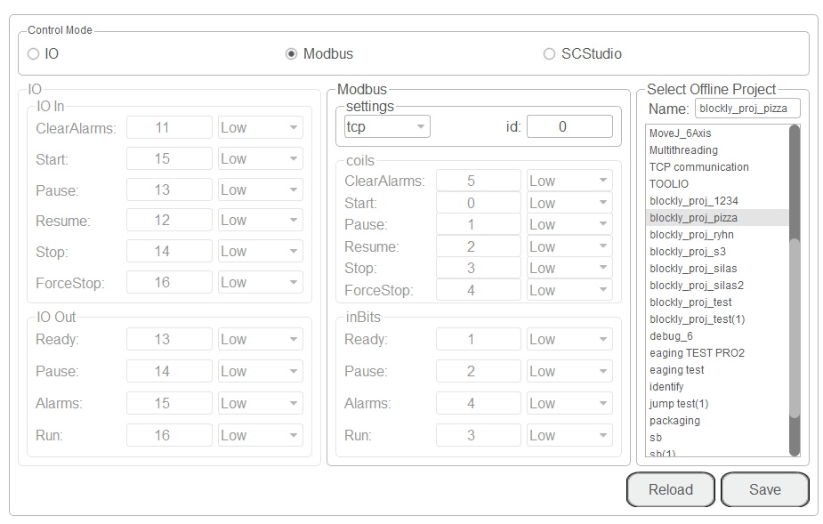

==============
Remote Control
==============

External equipment can send commands to a robot by different remote control modes such as remote
I/O mode and remote Modbus mode. The default mode is Teaching mode when the robot is shipped out.
When you need to set the remote mode, please set it on DobotSCStudio with the robot motor in the
disabled state.

.. note::

    -   Rebooting the cobot is not required when switching the remote mode.
    -   The emergency stop switch on the hardware is always available no matter what mode the robot
        system is in.
    -   Do not switch the remote mode when the robot is running in the current remote mode. You
        need to exit the current mode and then switch to the other remote mode. Namely, stop the
        robot running and then switch the mode.
    -   If the robot motor is in the enabled status, the remote control cannot be used. Otherwise,
        an alarm will be triggered. Activate remote control in the disabled status.

Remote I/O
~~~~~~~~~~

External equipment can control the robot when it is in remote I/O mode. The specific I/O interface
descriptions are shown in the table below.

+-----------------+-------------------------------------------+
| I/O Interface   |   Description                             |
+=================+===========================================+
| **Input (For external control)**                            |
+-----------------+-------------------------------------------+
| DI 11           |   Clear alarm                             |
+-----------------+-------------------------------------------+
| DI 12           |   Continue to run                         |
+-----------------+-------------------------------------------+
| DI 13           |   Pause in the I/O mode                   |
+-----------------+-------------------------------------------+
| DI 14           |   Stop and exit the I/O mode              |
+-----------------+-------------------------------------------+
| DI 15           |   Start in the I/O mode                   |
+-----------------+-------------------------------------------+
| DI 16           |   Emergency stop and exit the I/O mode    |
+-----------------+-------------------------------------------+
| **Output (For displaying the status)**                      |
+-----------------+-------------------------------------------+
| DO 13           |   Ready status                            |
+-----------------+-------------------------------------------+
| DO 14           |   Pause status                            |
+-----------------+-------------------------------------------+
| DO 15           |   Alarm status                            |
+-----------------+-------------------------------------------+
| DO 16           |   Running status                          |
+-----------------+-------------------------------------------+

.. note::

    All input signals are rising-edge triggered.

**Prerequisites**:

-   The project to be running in the remote mode has been prepared.
-   The external equipment has been connected to the robot system by the I/O interface.
-   The robot has been powered on and in the disabled status.

**Procedure**:

1.  Click **Parameter > Offline**. The remote control page will be displayed.

2.  Select **IO** on the **Control Mode** section and select the offline project in the **Select
    Offline Project** section and click **Save**.
3.  Trigger the starting signal on the external equipment. The robot will move as the selected
    offline project. If the stop signal is triggered, the remote I/O mode will be deactivated.

Remote Modbus
~~~~~~~~~~~~~

When the cobot is in Remote Modbus mode, external equipment can control a robot in this mode. The
specific Modbus register descriptions are shown in the table below.

+----------------------------+------------------+--------------------------------------------------+
| Register address           | Register address |  Description                                     |
| (Take a PLC as an example) | (Robot system)   |                                                  |
+============================+==================+==================================================+
| **Coil register**                                                                                |
+----------------------------+------------------+--------------------------------------------------+
| 00001                      | 0                | Start running in the remote Modbus mode          |
+----------------------------+------------------+--------------------------------------------------+
| 00002                      | 1                | Pause running in the remote Modbus mode          |
+----------------------------+------------------+--------------------------------------------------+
| 00003                      | 2                | Continue to run                                  |
+----------------------------+------------------+--------------------------------------------------+
| 00004                      | 3                | Stop and exit the remote Modbus mode             |
+----------------------------+------------------+--------------------------------------------------+
| 00005                      | 4                | Emergency stop and exit the remote Modbus mode   |
+----------------------------+------------------+--------------------------------------------------+
| 00006                      | 5                | Clear alarm                                      |
+----------------------------+------------------+--------------------------------------------------+
| **Discrete input register**                                                                      |
+----------------------------+------------------+--------------------------------------------------+
| 10001                      | 0                | Auto-exit                                        |
+----------------------------+------------------+--------------------------------------------------+
| 10002                      | 1                | Ready status                                     |
+----------------------------+------------------+--------------------------------------------------+
| 10003                      | 2                | Pause status                                     |
+----------------------------+------------------+--------------------------------------------------+
| 10004                      | 3                | Running status                                   |
+----------------------------+------------------+--------------------------------------------------+
| 10005                      | 4                | Alarm status                                     |
+----------------------------+------------------+--------------------------------------------------+

**Prerequisites**:

-  The project to be running in the remote mode has been prepared.
-  The robot has been connected to the external equipment using the Ethernet interface. The IP
   address of the robot system must be in the same network segment of the external equipment
   without conflict. You can modify the IP address on the **ToolConfig > NetworkSetting** page. The
   default port is **502** and cannot be modified.
-  The robot has been powered on and in the disabled status.

**Procedure**:

1.  Click **Parameter > Offline**. The remote control page will be displayed.

2.  Select **Modbus** on the **Control Mode** section and select the offline project in the
    **Select Offline Project** section and click **Save**.
3.  Trigger the starting signal on the external equipment. The robot execute the selected offline
    project. If the stop signal is triggered, the remote Modbus mode will be deactivated.
