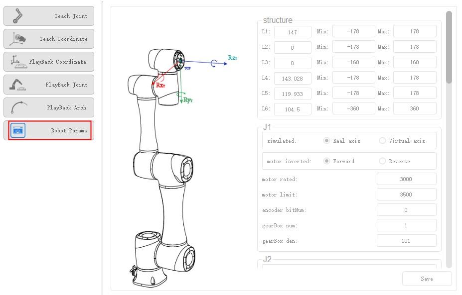
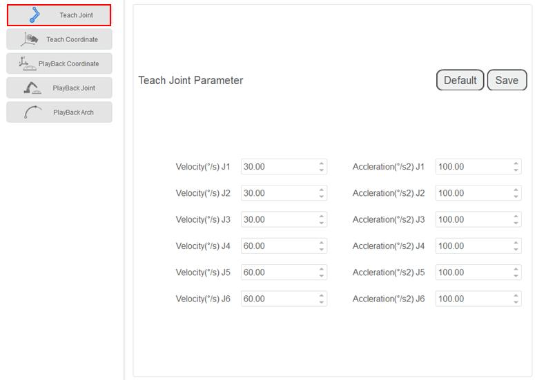
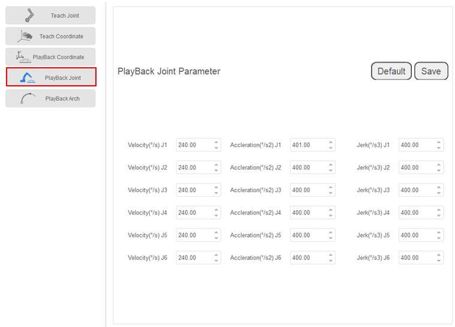
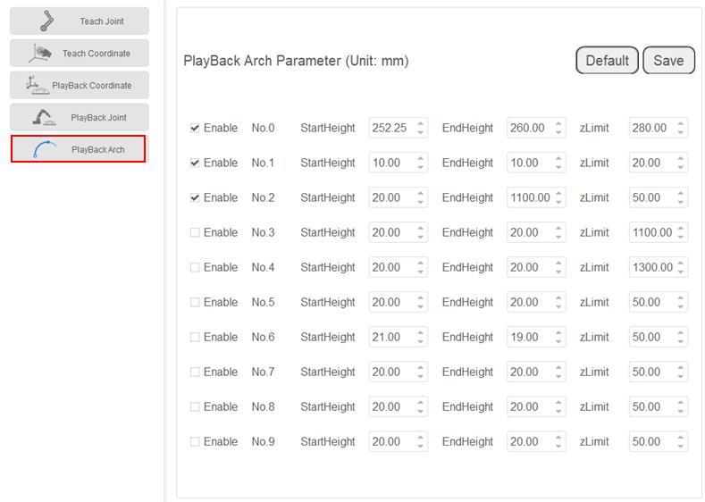

===========
RobotParams
===========

You can set the velocity, acceleration or other parameters in different coordinate systems when
jogging a robot or running robot programs. After setting the parameters, please click **Save**.
Click **Parameter > RobotParams** to enter **RobotParams** interface.

- **Teach Joint Parameter**: Set the maximum velocity and acceleration in the Joint coordinate
  system when jogging the robot.

- **Teach Coordinate**: Set the maximum velocity and acceleration in the Cartesian coordinate
  system when jogging a robot.

.. image:: _images/teachcoord.jpg
    :align: center

- **Playback Coordinate Parameter**: Set the maximum velocity, acceleration and jerk in the
  Cartesian coordinate system when running robot programs.

.. image:: _images/playbackcoord.jpg
    :align: center

- **Playback Joint Parameter**: Set the maximum velocity, acceleration, and jerk in the Joint
  coordinate system when running robot programs.

- **Playback Arch Parameter**: If the motion mode is Jump when running robot programs, you will
  need to set **StartHeight**, **EndHeight**, and **zLimit**. You can set 10 sets of Jump
  parameters.

