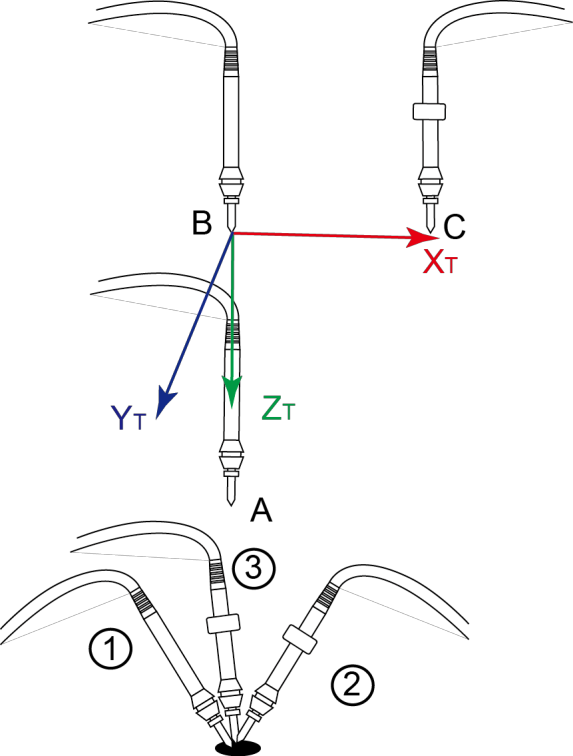
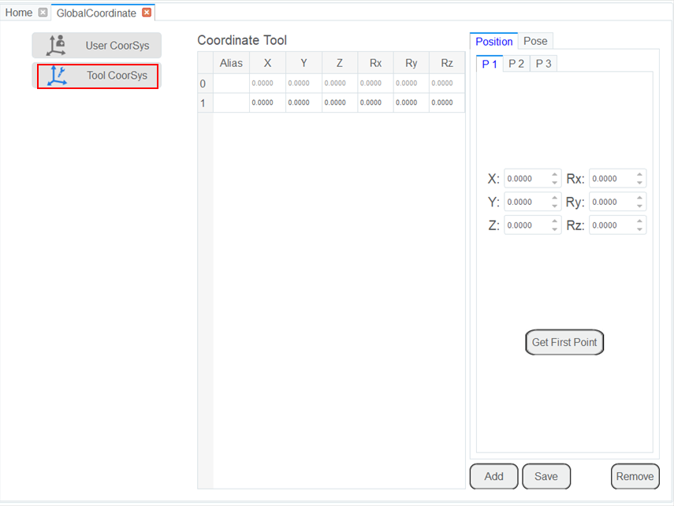

==============================
Setting Tool Coordinate System
==============================

When an end effector such as a welding gun or a gripper is mounted on the robot, you can set Tool
Coordinate Systems to more easily program positions and orientations. For example, you can use
multiple grippers to carry multiple workpieces simultaneously to improve the efficiency by setting
each gripper to a Tool coordinate system. There are 10 available groups of Tool coordinate systems.
Tool coordinate system 0 is the predefined Tool coordinate system which is located at the robot
flange and cannot be changed.

.. note::

    When creating a Tool coordinate system, make sure that the reference coordinate system is the
    predefined Tool coordinate system. Namely, the Tool coordinate system icon should be ``Tool:
    0`` when creating a Tool coordinate system.

The Tool coordinate system of a CR robot is created by three-point calibration method (TCP +ZX).
After the end effector is mounted, please adjust the direction of the end effector so that the Tool
Center Point (TCP) is aligned with the same point (reference point) in three different directions,
for obtaining the position offset of the end effector, and then jog the robot to the other three
points (**A, B, C**) to obtain the angle offset.

.. note::

    **Rx**, **Ry**, **Rz** are the orientation data, which are designated by rotating the tool
    center point (TCP) around the **X**, **Y**, and **Z** axes under the selected Tool coordinate
    system.

Take the establishment of Tool 1 coordinate system as an example.

**Prerequisites**:

- The robot has been powered on.
- The robot motor has been enabled.

**Procedure**:

1.  Mount an end effector on the robot.

2.  Click **Parameter > GlobalCoordinate > Tool CoorSys**. The Tool Coordinate page will be
    displayed, as shown below.

3.  Jog the robot to the reference point in the first direction, then click **Get First Point** on
    the **P1** tab of the **Position** page to obtain the coordinates of the first point.

4.  Jog the robot to the reference point in the second direction, then click **Get Second Point**
    on the **P2** tab of the **Position** page to obtain the coordinates of the second point.

5.  Jog the robot to the reference point in the third direction, then click **Get Third Point** on
    the **P3** tab of the **Position** page to obtain the coordinates of the third point.

6.  Jog the robot to the reference point (point **A**) in the vertical direction, then click **Get
    First Point** on the **P1** tab of the **Pose** page to obtain the fourth point.

7.  Jog the Z-axis to a point (point **B**) along the positive direction, then click **Get Second
    Point** on the **P2** tab of the **Pose** page to obtain the fifth point. This step defines the
    Z-axis.

8.  Jog the X-axis to another point (point **C**), then click **Get Third Point** on the **P3** tab
    of the **Pose** page to obtain the sixth point. This step defines the X-axis. The Y-axis is
    also defined, as it is calculated via the `right-hand rule`_.

.. _`right-hand rule`: https://en.wikipedia.org/wiki/Right-hand_rule

.. note::

    The three points (**A**, **B**, **C**) cannot lie in the same line.

9.  Click **Add** and **Save** to generate the Tool 1 system.

10. Click Select **User: 1** on the **Jog Panel**.

You can use the Tool 1 coordinate system for teaching and programming.
