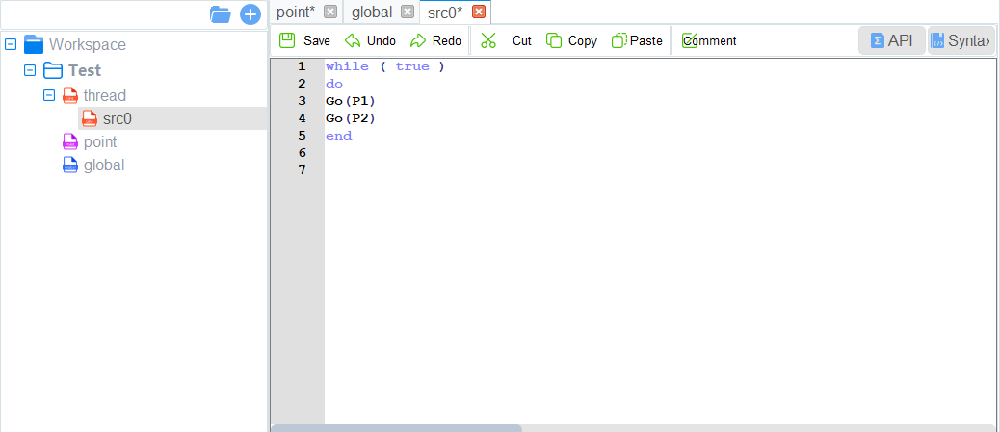
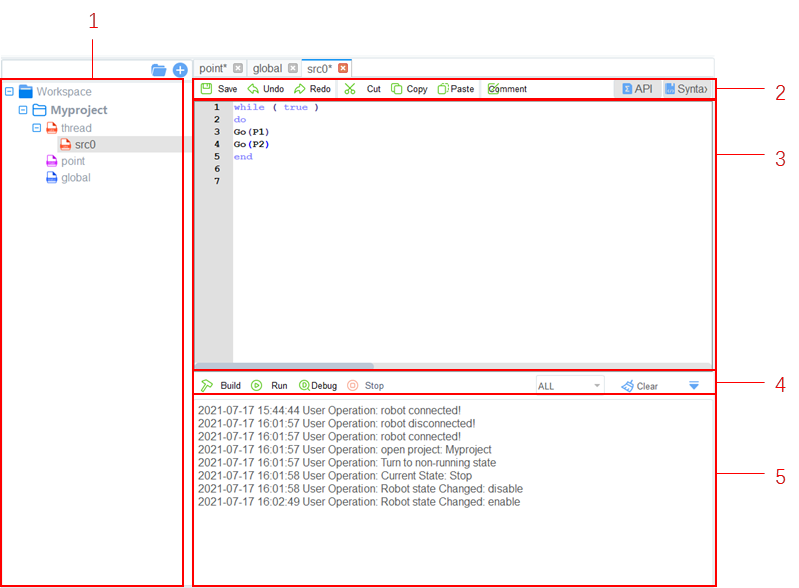
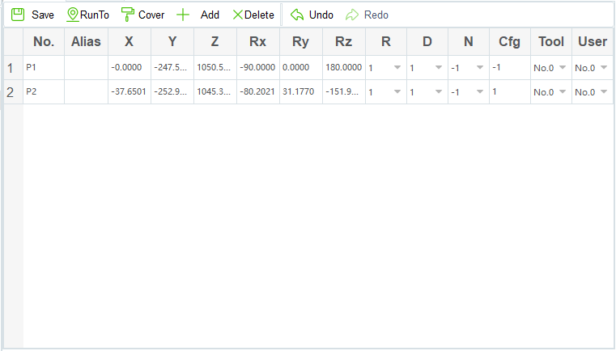

=========
Scripting
=========

DobotSCStudio offers a traditional script-based programming interface used to control the robot
using the Lua language.

Project Description
-------------------

Programs are managed in project form, including teaching points list, global variables, and program
files. The diagram below describes the structure of a project.

-   Multiple threads are supported in scripts. Up to 5 threads can be executed simultaneously.
    ``scr0.lua`` is the main thread. Other threads are sub threads, which run programs parallel to
    the main thread.
-   Motion commands cannot be called in subthreads. Only the main thread supports motion commands.
-   In addition, the global variable module is only used to define global variables and module
    functions. The motion commands cannot be called here.

Programming Interface Description
---------------------------------

When programming a robot, your authority level must be programmer or higher. The image below shows
the programming panel.

.. list-table::
    :header-rows: 1
    :widths: 5 15 50

    * - Number
      - Name
      - Description
    * - 1
      - Project Files
      - A directory tree of files related to all open projects
    * - 2
      - Common Button
      - Buttons used to interact with the programming area
    * - 3
      - Programming Area
      - A text editor used to create your routines, program functions, and
        define variables.
    * - 4
      - Running Button
      - Buttons used to interact with the project used build, run, stop, etc.
    * - 5
      - Debug Panel
      - Displays the debug output of the program

Programming Description
-----------------------

Creating Project
~~~~~~~~~~~~~~~~

**Prerequisites**:

- The robot has been powered on.

**Procedure**:

1.  Navigate to the script page.
2.  Start a new project by pressing the button displaying a page and a "+". Give your project a
    title and, if desired, select a template. Click **OK**.
3.  Set the number of threads based on site requirements. Click **thread** and right-click **New
    thread file**.
4.  (Optional) Import the existing taught positions list.

   -    If you want to reuse a taught positions list from an existing project, right-click
        **Point** and click **Import Points File**.

Import Project
~~~~~~~~~~~~~~

If you need to reuse project files from another robot, you can export project files from the robot
to your local computer and then import them into the current robot.

**Prerequisites**:

- The robot has been powered on.

**Procedure**:

1.  Click **Workspace** and right-click **Import Project**.
2.  Select a project to be imported.

    -   In the **Import Project** page, there are two files: ``prj.json`` and ``point.json``.
        Select the project file ``prj.json``.

3.  Click **Open**.

Teaching Points
~~~~~~~~~~~~~~~

**Prerequisites**:

- The project has been created or imported.

**Procedure**:

-   After creating a project, teach positions on the point page for calling
    commands when programming a robot. If the existing taught positions list has
    been imported, this operation can be skipped.

1.  Enable the robot.
2.  Click **Jog** buttons to move the robot to a point.
3.  Go to points tab and add the robot's current point to the list.

    -   You can select a taught position and double-click the parameters on the line to modify the
        relevant information.
    -   You can also press the **Cover** button to replace the selected point with the robot's
        current point.

4.  Continue adding points until all relevant points are in the list.
5.  Click **Save** to save all points.

Writing a Program
~~~~~~~~~~~~~~~~~

**Prerequisites**:

- The project has been created or imported.
- The points have been taught.

**Procedure**:

- Program your robot's routine according to your needs. The available commands
  and syntax are available in the Syntax panel. You can also view the
  `Lua Scripting Guide`_.

.. _`Lua Scripting Guide`: https://www.trossenrobotics.com/Shared/DOBOT/CR_Lua_Guide.pdf
