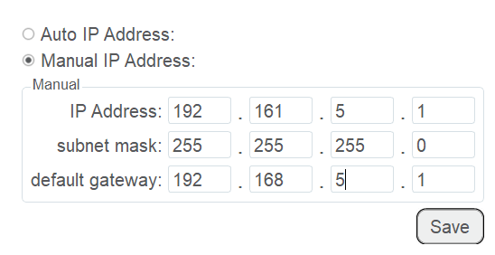

==============
NetworkSetting
==============

The robot system can be communicated with external equipment by the Ethernet interface which
supports TCP, UDP and Modbus protocols. The default IP address is ``192.16.5.1``. In real
applications, if the TCP or UDP protocol is used, the robot system can be a client or a server
based on site requirements; if the Modbus protocol is used, the robot system only can be the Modbus
slave, and the external equipment is the master.

You can modify the IP address on the **ToolConfig > NetworkSetting** page. The IP address of the
robot system must be in the same network segment of the external equipment without conflict.

-   If the robot system connects to the external equipment directly or with a switchboard, please
    select **Manual IP Address** and modify IP Address, subnet mask, default gateway, and then
    click **Save**.
-   If the robot system connects to the external equipment with a router, please select **Auto IP
    Address** to assign IP address automatically, and then click **Save**.

.. note::

    Do not insert the network cable into the LAN interface when using a router for the connection.
