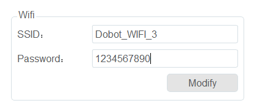

============
WiFi Setting
============

The robot system can be communicated with external equipment by the WiFi module. You can modify the
WiFi name and password on the **ToolConfig > WiFiSetting** page and then restart the controller to
put the changes into effect.

The default password is ``1234567890``.

