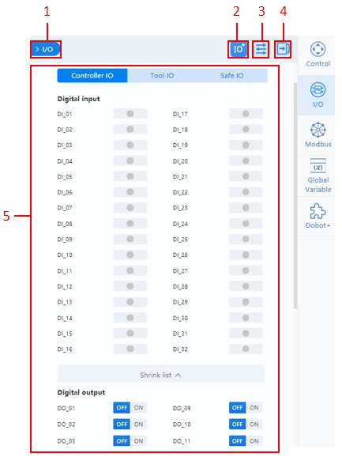
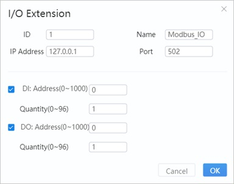
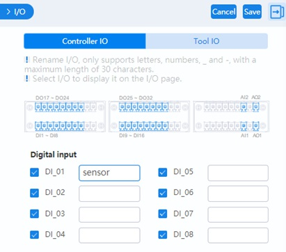
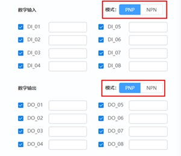
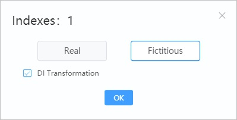
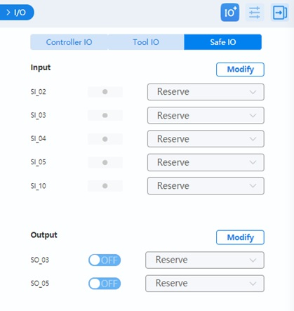

==============
I/O Monitoring
==============

I/O Panel Overview
==================

You can monitor and set the I/O status of the controller and the end tool in this menu. For the I/O
definition, refer to the IO description in the corresponding robot hardware guide. As different
controllers vary in the number of I/O ports, the screenshots in this document are for reference
only.

.. list-table::
    :header-rows: 1
    :widths: 5 60
    :align: center

    * - No.
      - Description
    * - 1
      - Click to hide the panel. Click **I/O** in the right toolbar to display the panel.
    * - 2
      - Click to add extended I/O. This can be used for monitoring Modbus communication. See
        :ref:`I/O extension <dobotstudiopro-io-extension>` for details.
    * - 3
      - Click to set an I/O alias or set the visibility of an I/O. See :ref:`I/O configuration
        <dobotstudiopro-io-config>` for details.
    * - 4
      - Click to fold the control panel. Click again to unfold the panel.
    * - 5
      - IO monitoring area. See :ref:`Monitoring <dobotstudiopro-io-monitoring>`.

.. _dobotstudiopro-io-extension:

I/O Extension
=============

*   **ID**: Slave device ID.
*   **Name**: Name of the slave device.
*   **IP address**: The IP address of the Modbus device.
*   **Port**: Port number of Modbus communication.
*   **DI/DO**: Configure the register address and number of DI/DO after selecting the function.

After clicking **OK**, a new I/O will appear in the bottom of I/O panel. This only takes effect
only after the controller is restarted.

Click **x** on the top right of the tab will delete this extension.

.. _dobotstudiopro-io-config:

I/O Configuration
=================

*   Select the I/O to display on the monitoring page.
*   Enter the alias of the IO on the right side. The alias will be displayed on the monitoring
    page. You can also call the corresponding I/O through the alias in block programming and script
    programming.
*   With a CCBOX-type controller, you can set digital input/output type to PNP (high-level active)
    or NPN (low-level active), as shown in the figure below.

.. _dobotstudiopro-io-monitoring:

Monitoring
==========

Controller I/O and Tool I/O page supports the following functions.

*   **Output**: Set the digital output or analog output.
*   **Monitor**: Monitor the status of the input and output.
*   **Simulate**: Simulate digital input status for debugging, as shown below.

You can set the functions of each safe I/O interface in the Safe I/O page. For details on the safe
I/O, refer to the I/O description in the corresponding robot hardware guide.

With a CCBOX-type controller, safe I/O and universal I/O share the same terminal. The terminal
configured as safe I/O cannot be configured as remote I/O.

