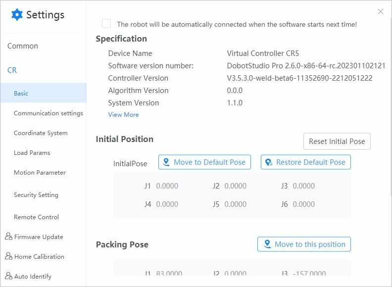
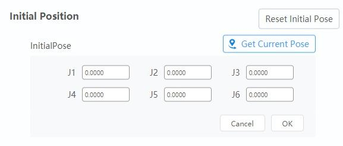
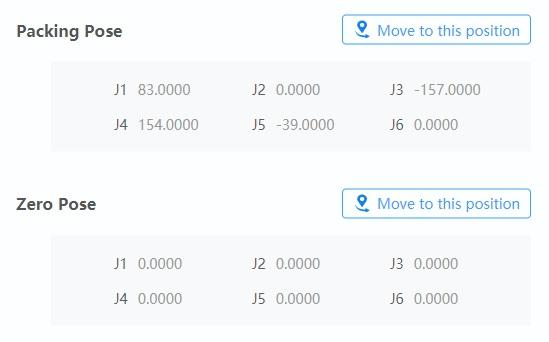

==============
Basic Settings
==============

Overview
========

The Basic Settings page is used to see device specifications and set the robot's pose.

*   **The robot will be automatically connected when the software starts next time**: Checking this
    box tells DobotStudio Pro to attempt to connect to this robot automatically the next time it is
    opened.
*   **View More**: Shows more firmware version information.

Initial Position
================

The initial position is a configurable robot configuration that is the home pose by default - one
in which all joints are at their zero position.

*   **Initial Position > Reset Initial Pose**: Set joint values for the Initial Pose

*   **Initial Position > Move to Default Pose**: Long press to command the robot to its Default
    Pose.
*   **Initial Position > Restore Default Pose**: Reset the Default Pose to the zero position.

Packing and Zero Pose
=====================

*   **Packing Pose > Move to this position**: Long press to command the robot to its packing
    position.
*   **Zero Pose > Move to this position**: Long press to command the robot to its zero.
