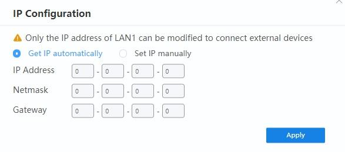
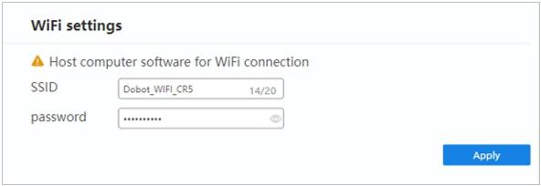

======================
Communication Settings
======================

IP Setting
==========

The LAN2 network interface's IP address, subnet mask, and gateway can be modified in this menu. The
robot can communicate with external equipment through its LAN2 network interface to devices that
support TCP, UDP, and Modbus protocols. The robot must be within the same network segment as that
of the external equipment and there cannot be conflict in addresses. The default IP address is
``192.168.5.1``.

WiFi Setting
============

You can modify the WiFi's name and password in this menu. The robot can communicate with external
equipment through WiFi. Once set, the robot must be restarted for the change to take effect. The
default password is ``1234567890``.

