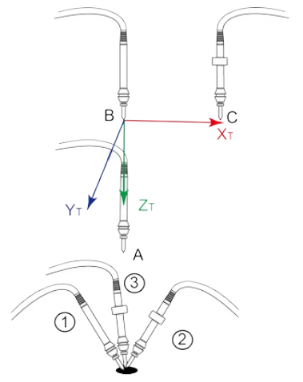
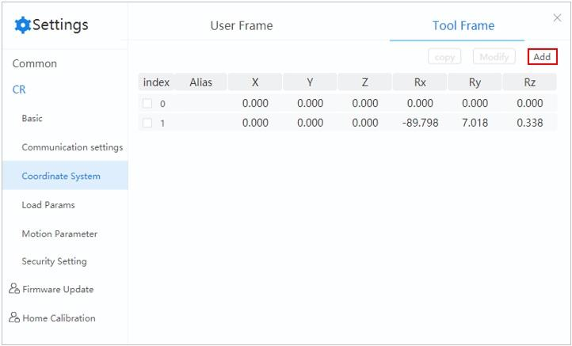
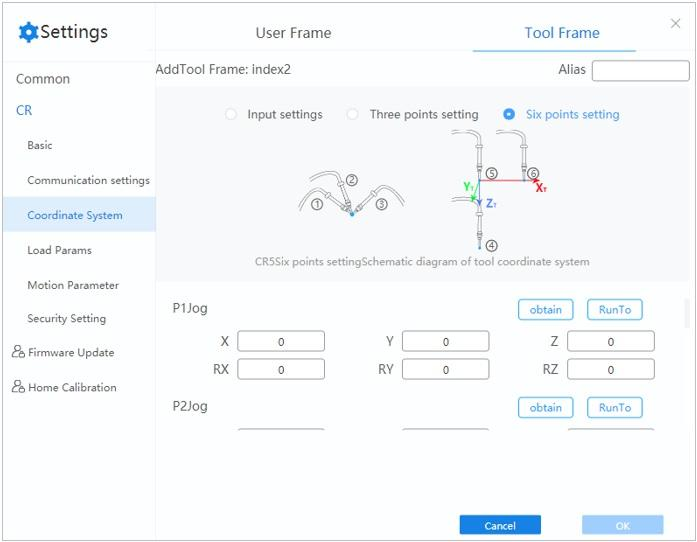
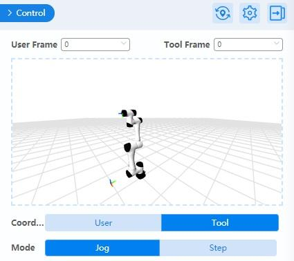

======================
Tool Coordinate System
======================

When an end effector such as welding gun or gripper is mounted on the robot, a tool coordinate
system is required for programming and operation. For example, when using multiple grippers to
carry multiple workpieces simultaneously, you can set a tool coordinate system for each gripper to
improve efficiency and ease of programming.

DobotStudio Pro supports up to ten tool coordinate systems. Tool coordinate system 0 is the base
coordinate system which is located at the robot flange and cannot be changed.

.. note::

    When creating a tool coordinate system, make sure that the reference coordinate system is the
    base coordinate system.

The tool coordinate system of a six-axis robot is created by a six-point calibration method. After
mounting the end effector, adjust the direction of the end effector to make the Tool Center Point
(TCP) align with the same reference point in three different directions to obtain the position
offset of the end effector. Then jog the robot to three other points (A, B, C) to obtain the angle
offset.

Creating a Tool Coordinate System
=================================

1.  Mount an end effector on the robot.
2.  Click **Add**.

3.  Select **Six points setting** in "Add Tool Frame: index2" page.

.. note::

    *   When creating a tool coordinate system, make sure that the reference coordinate system is
        the base coordinate system 0.
    *   Long pressing **Run To** can move the robot to the set points.

1.  Jog the robot to the reference point in the first direction, then click **obtain** on the P1
    panel.
2.  Jog the robot to the reference point in the second direction, then click **obtain** on the P2
    panel.
3.  Jog the robot to the reference point in the third direction, then click **obtain** on the P3
    panel.
4.  Jog the robot to the reference point in the vertical direction, then click **obtain** on the P4
    panel.
5.  Jog Z-axis along the positive direction to move the robot to another point, then click
    **obtain** on the P5 panel.
6.  Jog X-axis along the positive direction to move the robot to point P6 (not in the same line
    with P4 and P5). Click **obtain** on the P6 panel.
7.  Click **OK**. The tool coordinate system is created successfully.

After adding or modifying a tool coordinate system, you can select a tool coordinate system in the
control panel and jog the robot arm.

.. note::

    When creating or modifying a Tool coordinate system, you can also select **Input settings** or
    **Three points setting** in Step 3.

Other operations
================

Modify a coordinate system
--------------------------
Select a coordinate system and click **Modify**. The procedure to modify an existing coordinate
system is the same as adding a new coordinate system.

Copy a coordinate system
------------------------

Create a new coordinate system based another by selecting a coordinate system and clicking
**copy**. This new system will be the same as the copied one.
