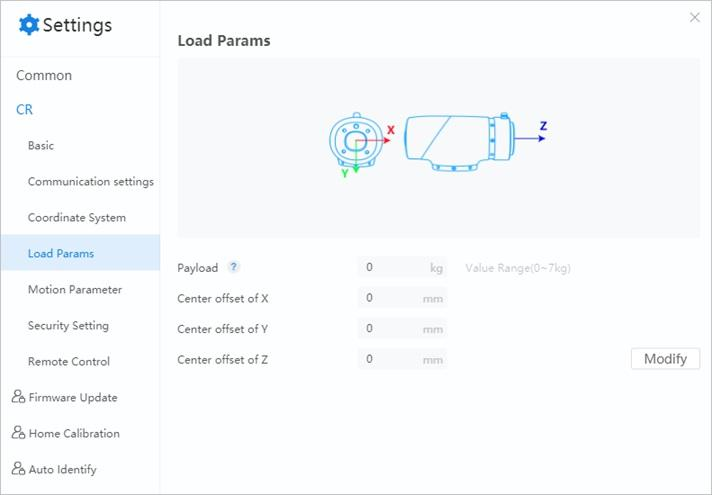

===============
Load Parameters
===============

To ensure optimal robot performance, it is important to make sure the load and eccentric
coordinates of the end effector are within the maximum range for the robot, and that Joint 6 does
not become eccentric. Setting load and eccentric coordinates improves the motion of robot and
reduces vibration.

.. note::

    Every time you enable the robot, the "Load Enable Modification" window will pop up which
    requires you to set the load parameters. The parameters you set will be synchronized to this
    "Load Params" page.

Click **Modify** to modify the load parameters.

*   Eccentric coordinates of the payload should be set when J6 is 0°.
*   The load weight includes the weight of the end effector and workpiece. This should not exceed
    the maximum payload of the robot arm.

After setting the parameters, click **OK**.

.. attention::

    Set load and eccentric coordinates properly. Otherwise, it may cause errors or excessive shock,
    and will shorten the lifespan of the robot.
