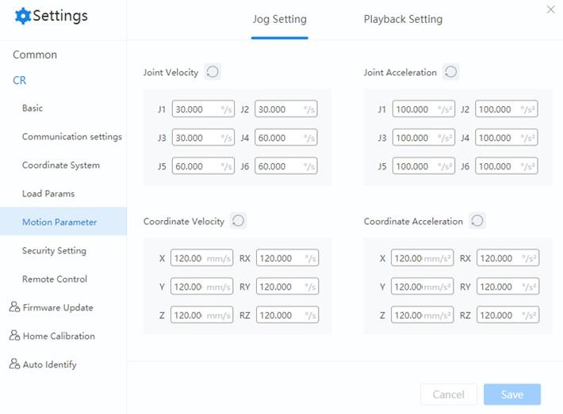
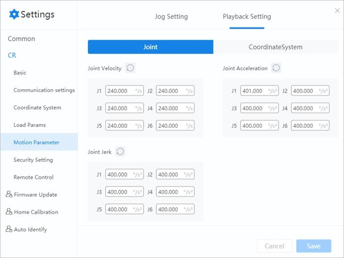

=================
Motion Parameters
=================

Jog Setting
===========

You can set the maximum speed and acceleration in the Joint coordinate system and Cartesian
coordinate system in this menu. Click **Save** after setting the parameters.

::

    Actual robot speed/acceleration = set speed/acceleration * global speed ratio.

Clicking the refresh button will restore all values in the corresponding module to their default
values.

Playback Setting
================

You can set the velocity, acceleration and jerk in the Joint coordinate system and Cartesian
coordinate system in this menu. Click **Save** after setting the parameters.

::

    Actual robot speed/acceleration = set speed/acceleration * global speed ratio * set percentage in speed commands when programming

Clicking the refresh button will restore all values in the corresponding module to their default
values.
