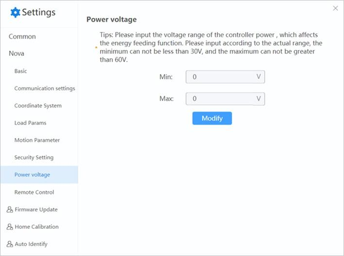

=====================
Power Voltage (CCBOX)
=====================

When using a CCBOX-type controller, you need to set the input voltage range of the controller. Set
this value according to the actual range of input voltage, with maximum voltage no more than 60V
and minimum voltage no less than 30V.

