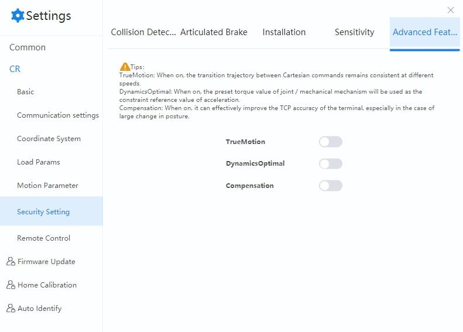

==================
Advanced Functions
==================

If you need to enable or disable the advanced functions, you can configure them in this page. It is
recommended to keep the default value if you do not have special requirements.

.. note::

    The function requires manager authority (default password: ``888888``).

