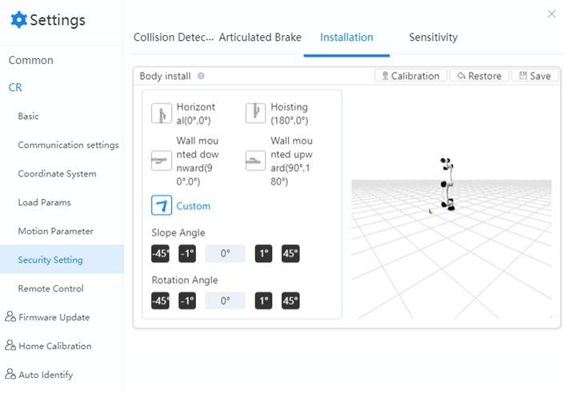
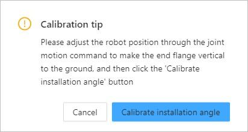

============
Installation
============

If the robot is mounted on a flat table or floor, you do not need to configure anything in this
page. However, if the robot is ceiling mounted, wall mounted, or mounted at an angle, you need to
set the rotation angle and slop angle when the robot is disabled.

Select the installation posture based on the robot's installation. Alternatively, after installing
and enabling the robot, you can also click **Calibration** and follow the directions in the pop-up
box to automatically obtain the tilt angle and rotation angle.

*   Slop angle is the counter-clockwise rotation around the robot's X-axis.
*   Rotation angle is the counter-clockwise rotation around the robot's Z-axis.

*   Click **Save** after calibration to save the settings.
*   Click **Restore** to restore the calibrated angle to the default value.
