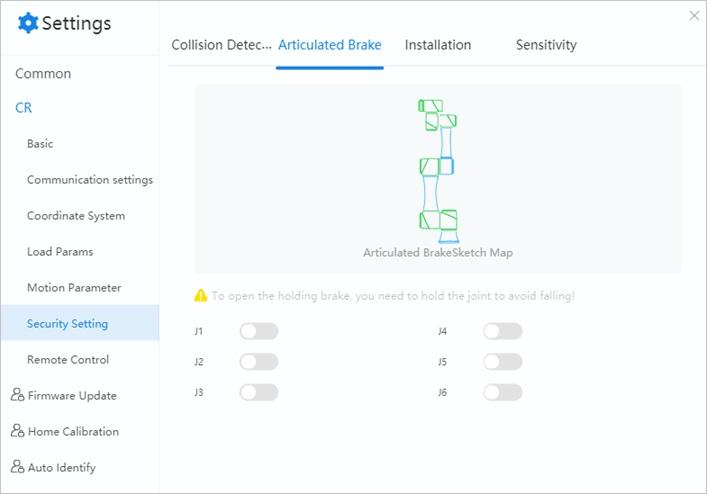

===========
Joint Brake
===========

Braking prevents the motor shaft from moving when the driver is not in operation. The motor keeps
its position locked and ensures that the robot will not move under its own weight or some external
force.

If you want to drag joints manually, you can disable the brake function, that is, hold the joint
manually after the robot arm is disabled, then click the button of the corresponding joint.

.. warning::

    The robot will fall due to gravity when the brake is released. When disabling the joint brake,
    hold the joint with your hand to prevent it from moving.
