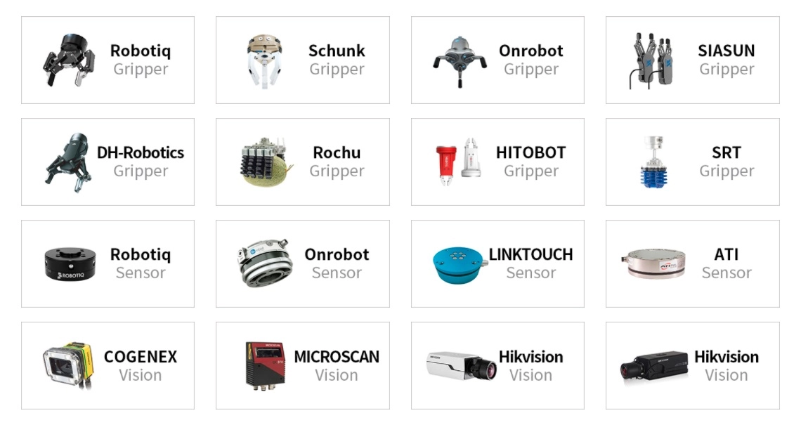

======================
End Effector Selection
======================

Dobot recommends a wide variety of end effectors depending on your application. The end effectors
shown in the image below are listed because Dobot has verified that these vendors meet their
performance criteria.

.. _end-effector-selection-trossen-robotics-end-effector-selection-label:

Trossen Robotics End Effector Selection
=======================================

We carry the following End Effectors to provide our customers with a faster and
more convenient shopping experience.

.. toctree::
    :maxdepth: 1

    end_effectors/dh_robotics.rst

.. Concepts
.. ========

.. Below are just some of the options you have available to you when selecting an
.. end effector for your robot application.

.. Sensing
.. -------

.. When it is necessary to perform reliable, repeatable, and automated data
.. acquisition.

.. Scanning
.. ~~~~~~~~

.. Build a 3 dimensional reconstruction of an object using a 2D front-facing lidar
.. or a depth camera.

.. Machine Vision
.. ~~~~~~~~~~~~~~

.. Inspect workpieces for wear and tear and perform non-destructive evaluation.

.. Grippers
.. --------

.. When it is necessary to move, sort, and place components.

.. Finger Grippers
.. ~~~~~~~~~~~~~~~

.. Use parallel, adaptive, or other kinds of finger-like grippers to move parts
.. around the robot's workspace.

.. Suction
.. ~~~~~~~

.. Another method of moving smoother and more regular components without putting
.. much force on them.

.. Soft Grippers
.. ~~~~~~~~~~~~~

.. These flexible grippers deform around an object to better handle irregular
.. parts.

.. Operation
.. ---------

.. Use your end effector to perform operations on parts or assemblies.

.. Tooled End Effectors
.. ~~~~~~~~~~~~~~~~~~~~

.. A classic example of a tooled end effector is using torque wrenches to
.. accurately install screws on an assembly.

.. Paint Sprayers/Sand Blasters
.. ~~~~~~~~~~~~~~~~~~~~~~~~~~~~

.. Automated application and removal of solvents and paints.
