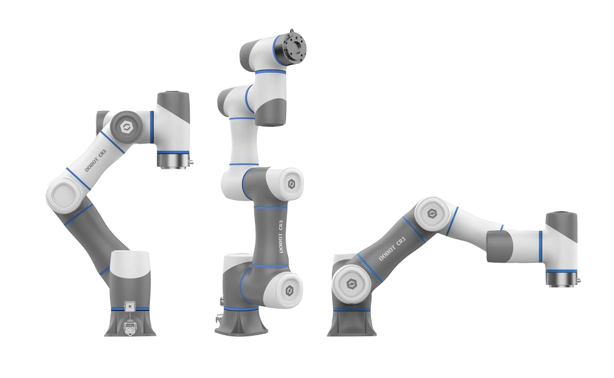

========================
Dobot CR-Series Cobots
========================

Industrial & Cobot arms built to power the automation of your business. These high accuracy
platforms are ideal for working environments where people are near by, featuring built in collision
detection & avoidance. Cobot arms are also intended to be far simpler to deploy. Physically pose
and capture movements with the touch of a button and record sequences of movements without any
programming knowledge. Visual Programming interfaces also make automation setup attainable for
those with no coding experience.

What's Here
===========

*  :doc:`specifications` - Specifications for the CR Cobots and related hardware.
*  :doc:`getting_started` - Guides to walk you through the process of setting up your cobot.
*  :doc:`end_effectors` - Specification and usage information about related industrial end
   effectors.
*  :doc:`dobotstudiopro` - Guides on how to use Dobot's Industrial Control software.
*  :doc:`dobotscstudio` - Guides on how to use Dobot's legacy Industrial Control software.
*  :doc:`io_interface` - Guides on how to use the cobot's I/O interface.
*  :doc:`modbus_interface` - Guides on how to use the cobot's Modbus interface.
*  :doc:`tcpip_protocol` - Guides on how to use the TCP/IP protocol.
*  :doc:`cobot_applications` - Guides on how to set up different applications like pick and place.

Choosing the Right Cobot
------------------------

The CR Series of Industrial Cobot arms offer payload capacities of 3kg, 5kg, 10kg and 16kg and a
maximum reach of 795mm to 1525mm making them suitable for a wide variety of environments. When
choosing a platform, the space in which the arm will operate and the weight of the objects being
manipulated are the two largest factors in determining which model will work for your application.
We recommend determining the weight and reach requirements before selecting the appropriate
platform.

See the :doc:`CR-Series Family Specifications <./specifications>` for more specific information
about each arm.

Choosing the Right End Effector
-------------------------------
With the many different applications of cobots in manufacturing there's an equal if not greater
number of customized end-tooling that can be deployed with the platforms. There are many different
considerations when choosing the right end effector for your application, machine tending, sanding,
screw driving etc. all require very different end effectors that perform specific tasks. Many tasks
can be accomplished with the use of a simple electric finger style gripper. We offer many different
end effectors to suit almost any application. If you need assistance in selecting one or don't see
what you're looking for, let us know.

See :ref:`End Effector Selection
<end-effector-selection-trossen-robotics-end-effector-selection-label>` for more specific
information about end effector concepts and the selection we offer.

Table of Contents
=================

.. toctree::
   :maxdepth: 2

   specifications.rst
   getting_started.rst
   end_effectors.rst
   dobotstudiopro.rst
   dobotscstudio.rst
   io_interface.rst
   modbus_interface.rst
   tcpip_protocol.rst
   cobot_applications.rst
