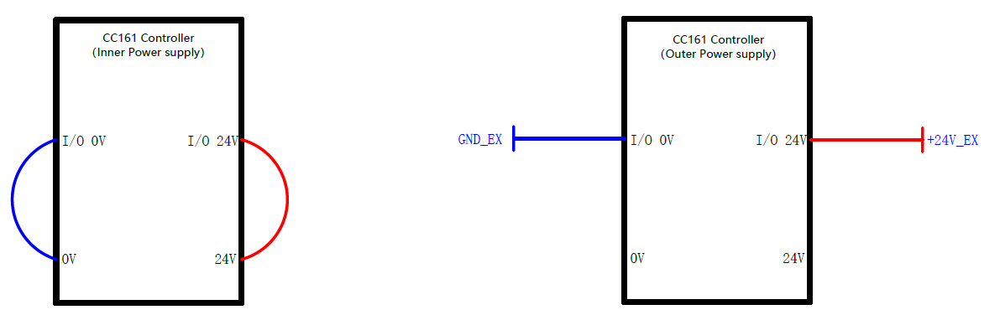

=============
I/O Interface
=============

Controller I/O
==============

Controller I/O Interface Description
------------------------------------

The robot controller contains I/O interfaces, for connecting to external equipment such as an air
pump, PLC, etc. These I/O interfaces provide 32 digital inputs, 16 digital outputs, 2 analog
outputs, and 2 analog inputs.

Powering the Panel
------------------

The controller's IO panel must be powered by a 24V source for operation. The diagram below
describes how the panel can be powered. The controller contains an internal power supply that can
be used (left), or an external power supply can be used (right).

.. warning::

    Do not use both the internal and an external power source at the same time. This has the
    potential to damage the controller.

.. note::

    The internal power supply is limited to a maximum current draw of 2A. The external power supply
    should be limited to a maximum current draw of 4A.

Wiring and Triggering Digital Inputs and Outputs
------------------------------------------------

The graphic below shows how to wire the controller and your device for input and output.

On the left, you can see how **digital output** should be configured. Once your controller's I/O
port is set for output, you can trigger your device by setting the output to high. This setup
allows the ground of your device to be connected to the ground on the controller. Your device must
be triggered with a small drive current. The output voltage for the controller's digital output is
24VDC.

On the right, you can see how **digital input** should be configured. Once your controller's I/O
port is set for input, you can trigger your controller by providing a high signal to the DI port.
This setup allows the ground of your device to be connected to the ground on the controller, and
allows the +24V I/O output to power your device. The controller considers a signal as `high` when
the DI voltage is at or near 24VDC. The controller considers a signal as `low` when the DI voltage
is at or near 0VDC.

.. image:: io_interface/_images/controller_inputoutput.png
    :align: center

.. Examples
.. --------

.. Digital Input
.. ~~~~~~~~~~~~~

.. Digital Output
.. ~~~~~~~~~~~~~~

End Effector I/O
================

The cable used for the end pins is the designated cable, the model is the **Lumberg RKMV 8-354**.
The end I/O pins are shown below.

.. image:: io_interface/_images/end_io.png
    :align: right
    :width: 350

+------+-----------+-------------+------------------------+
| Pins | Name      | Cable Color | Description            |
+======+===========+=============+========================+
| 1    | AI_1/485A | White       | Analog input 1 / 485A  |
+------+-----------+-------------+------------------------+
| 2    | AI_2/485B | Brown       | Analog input 2 / 485B  |
+------+-----------+-------------+------------------------+
| 3    | DI_2      | Green       | Digital input 2        |
+------+-----------+-------------+------------------------+
| 4    | DI_1      | Yellow      | Digital input 1        |
+------+-----------+-------------+------------------------+
| 5    | 24V       | Gray        | 24V(Out)               |
+------+-----------+-------------+------------------------+
| 6    | DO_2      | Pink        | Digital output 2       |
+------+-----------+-------------+------------------------+
| 7    | DO_1      | Blue        | Digital output 1       |
+------+-----------+-------------+------------------------+
| 8    | GND       | Red         | GND                    |
+------+-----------+-------------+------------------------+
