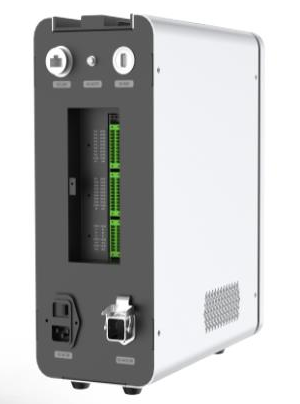
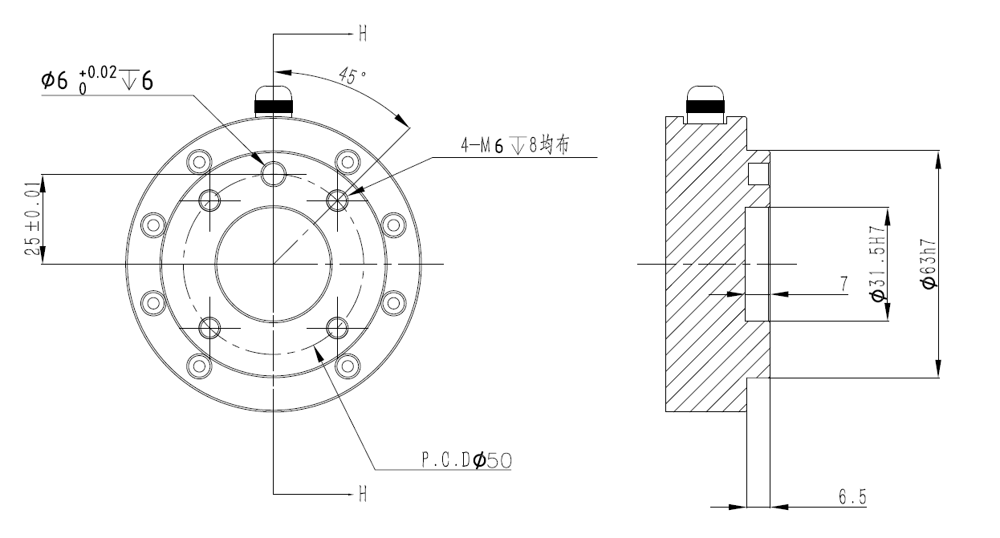

==============
Specifications
==============

In-Depth CR-Series Arm Specifications
-------------------------------------

This section provides links to each of the CR-Series Arms' more detailed specifications.

.. toctree::
    :maxdepth: 1

    specifications/cr3.rst
    specifications/cr5.rst
    specifications/cr10.rst
    specifications/cr16.rst

Whole Family Specifications
---------------------------

.. list-table::
    :header-rows: 1
    :align: center
    :widths: 5 10 10 10 10 10 10

    * - Cobot Name
      - Maximum Reach
      - Repeatability
      - Maximum Payload
      - Product Weight
      - Total Workspace
      - Recommended Workspace
    * - CR3
      - 795mm
      - ±0.02mm
      - 3kg
      - 16.5kg
      - 1590mm
      - 1113mm
    * - CR5
      - 1096mm
      - ±0.02mm
      - 5kg
      - 23kg
      - 2192mm
      - 1534mm
    * - CR10
      - 1525mm
      - ±0.03mm
      - 10kg
      - 38kg
      - 3050mm
      - 2135mm
    * - CR16
      - 1223mm
      - ±0.03mm
      - 16kg
      - 37kg
      - 2446mm
      - 1712mm

Controller Specifications
-------------------------

.. csv-table::
    :file: /_data/controller.csv
    :widths: 20 60
    :align: center

End Effector
------------

End Effector Size
~~~~~~~~~~~~~~~~~

Load Description
~~~~~~~~~~~~~~~~

The robot actuator can bear the load of the cylinder whose center of mass is located at an axial
distance of LD80mm from the center of the end effector and a radial distance of LR60mm and no more
than maximum payload.

.. image:: specifications/_images/endeffector_load.png
    :align: center

Certifications
--------------

The Dobot CR-Series cobots and their controllers are  UL 1740 certified by SGS North America. You
can download the certificate and procedure below.

-   :download:`SGS UL Certificate of Compliance </_downloads/SGS_UL_CERTIFICATE.pdf>`
-   :download:`SGS UL Procedure </_downloads/SGS_UL_PROCEDURE.pdf>`
