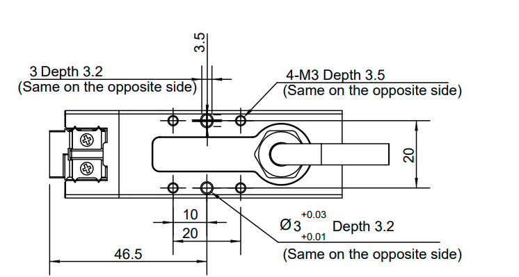
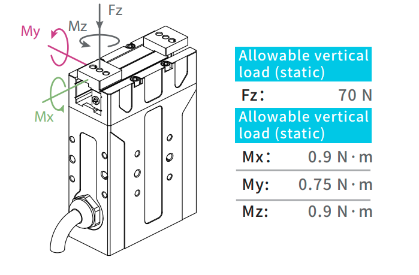
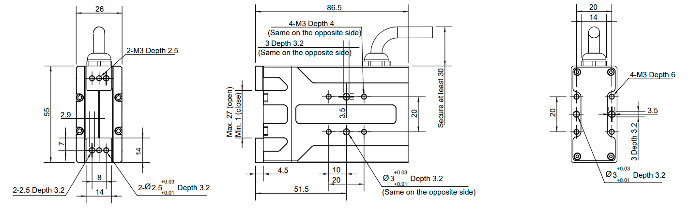

========================================
DH-Robotics PGE-15 Slim Parallel Gripper
========================================

.. list-table::
    :widths: 50 50

    * - .. list-table::
            :header-rows: 1
            :align: center
            :widths: 30 40

            * - Characteristic
              - Value
            * - Gripping Force
              - 6~15 N
            * - Stroke
              - 26mm
            * - Gripping Weight
              - 0.25 kg
            * - Repeat Accuracy (Gripping)
              - ± 0.3 N
            * - Repeat Accuracy (Positioning)
              - ± 0.02 mm
            * - Opening / Closing
              - 0.5 s/0.5 s
            * - Weight
              - 0.4 kg
            * - Noise Emission
              - < 40 dB
            * - Communication Interface
              - | Standard: Modbus RTU (RS485), Digital I/O
                | Optional: TCP/IP, USB2.0, CAN2.0A, PROFINET, EtherCAT
            * - Nominal Voltage
              - 24 V DC ± 10%
            * - Nominal Current
              - 0.4 A
            * - Max Current
              - 0.7 A
            * - IP Rating
              - IP 40
            * - Recommended Operating Environment
              - 0~40°C, < 85% RH
      - .. image:: _images/pge15.png
            :align: center
            :width: 100%

