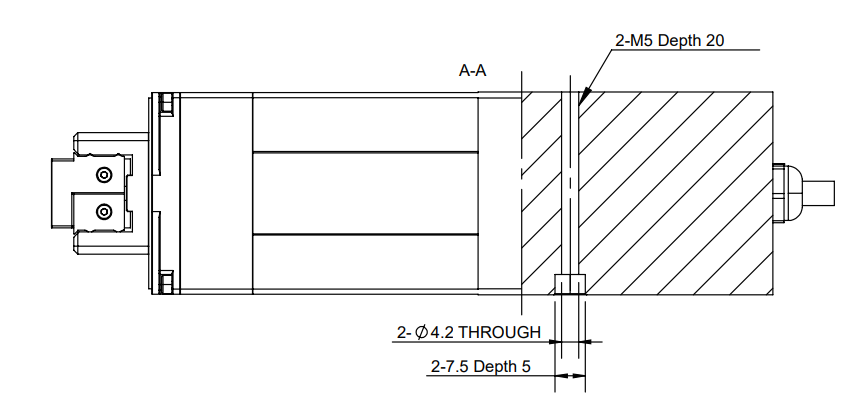
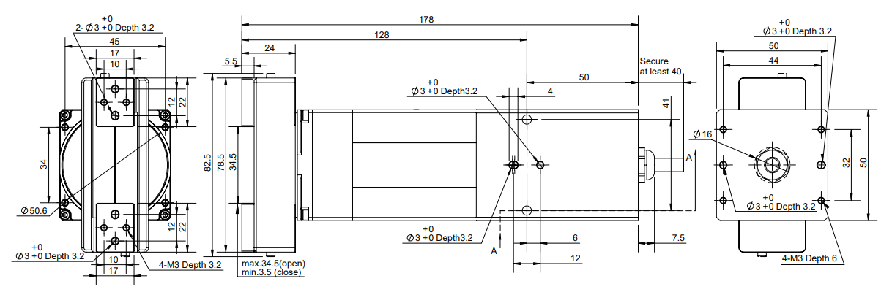

=======================================
DH-Robotics RGI-14 Rotary Cobot Gripper
=======================================

.. list-table::
    :widths: 50 50

    * - .. list-table::
            :header-rows: 1
            :align: center
            :widths: 30 40

            * - Characteristic
              - Value
            * - Gripping Force
              - 10~35 N
            * - Stroke
              - 30mm
            * - Rotation Torque
              - 0.25 N·m
            * - Weight
              - 1.2 kg
            * - Max. Rotation Speed
              - 1500 deg/s
            * - Opening / Closing
              - 0.3 s/0.3 s
            * - Communication Interface
              - | Standard: Modbus RTU (RS485), Digital I/O
                | Optional: TCP/IP, USB2.0, CAN2.0A, PROFINET, EtherCAT
            * - Nominal Voltage
              - 24 V DC ± 10%
            * - Nominal Current
              - 1.1 A
            * - Max Current
              - 2 A
            * - IP Rating
              - IP 20
            * - Recommended Operating Environment
              - 0~40°C, < 85% RH
      - .. image:: _images/rgi30.png
            :align: center
            :width: 100%

.. image:: _images/rgi30load.png
    :align: center

