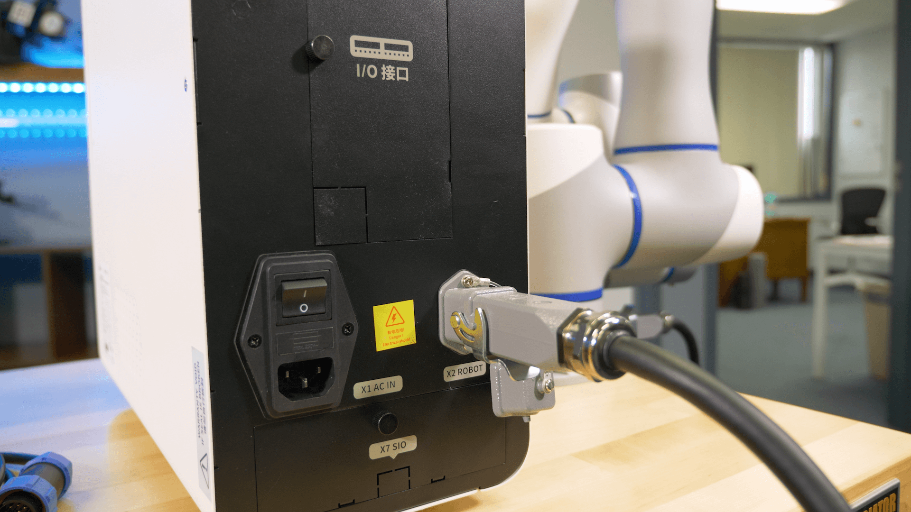
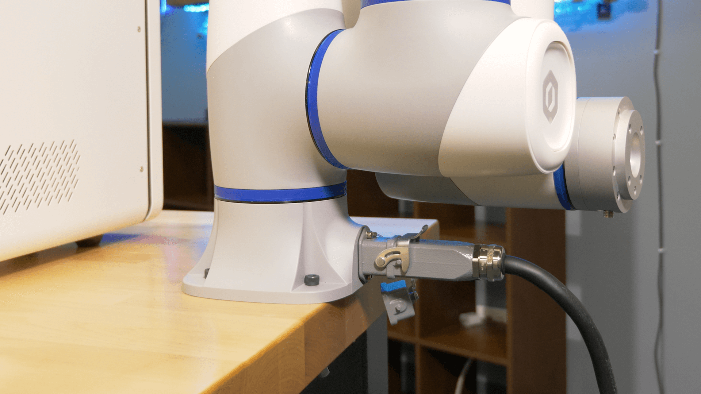
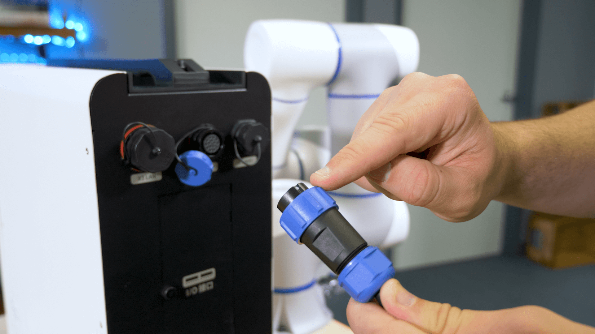
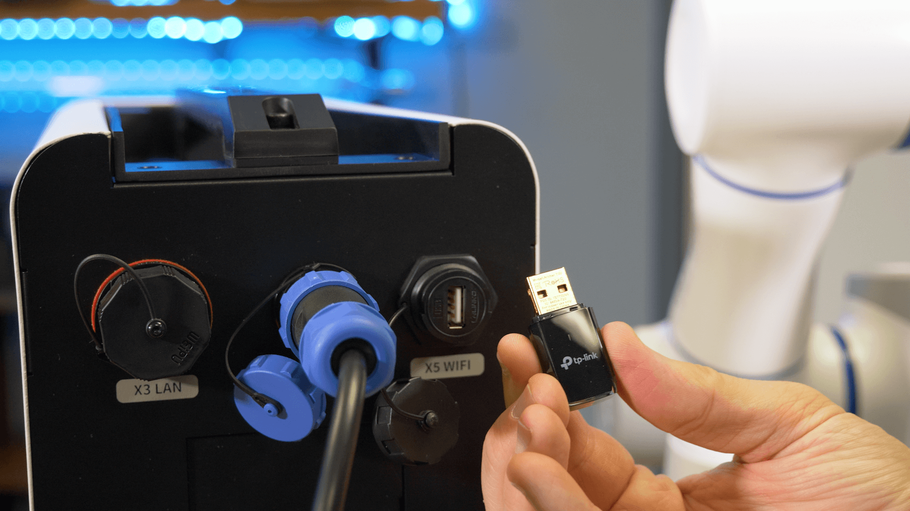
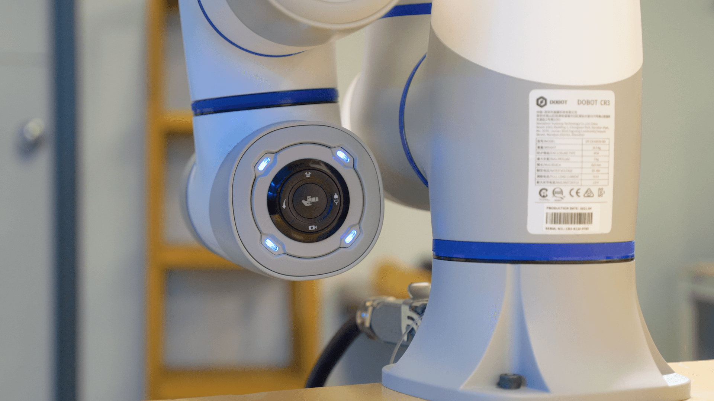

==============
Hardware Setup
==============

This section details the hardware setup for your CR-Series Cobot.

1.  Unbox the robot and mount it securely in your workstation. More details on how to mount your
    robot can be found in the :doc:`Mounting <./mounting>` section.

2.  Plug the power and control cable from the back of the controller to the port on the robot.

3.  Plug the wall power cable into a wall outlet and to the back of the controller.

.. image:: _images/wall_power_controller.png
    :align: center
    :width: 50%

4.  Uncap the middle connector at the top of the controller. Plug in the emergency stop connector.
    Make sure the white dots at the top of the connectors are aligned.

.. image:: _images/white_dot_connector.png
    :align: center
    :width: 50%

.. image:: _images/plug_in_estop.png
    :align: center
    :width: 50%

5.  If using wifi, plug your wifi dongle into the usb port.

6.  If using ethernet, plug your ethernet cable into the ethernet port.

.. image:: _images/ethernet.png
    :align: center
    :width: 50%

7.  Flick the switch at the bottom of the controller to the on position.

.. image:: _images/flip_switch_on.png
    :align: center
    :width: 50%

8.  Turn the controller on.

.. image:: _images/turn_controller_on.png
    :align: center
    :width: 50%

9.  Watch for the blinking lights on the button panel of the robot, indicating that the robot is
    powered on.

Video Tutorial
--------------

.. youtube:: SxMt3-MuoYE
    :align: center
