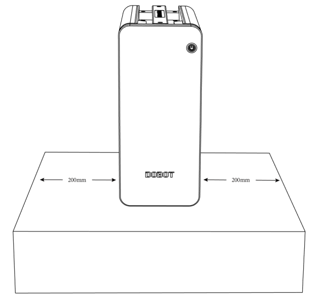
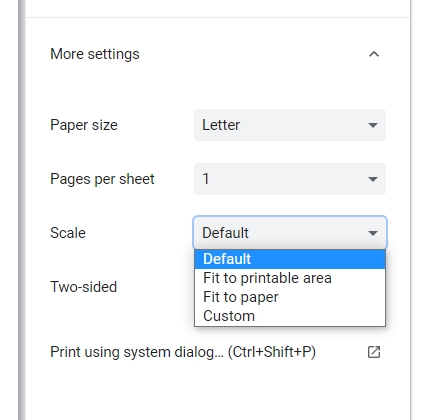

===============================
Cobot Installation and Mounting
===============================

Cobot Installation Environment
------------------------------

To ensure good performance and safety, please place the controller and robot in an environment with
the following conditions:

-   Install indoors in a room with good ventilation.
-   Do not install in a closed environment.
-   Keep away from direct sunlight.
-   Keep away from dust, oil, smoke, salinity, metal powder, corrosive gases, and other
    contaminants.
-   Keep away from flammable materials.
-   Keep away from cutting and grinding fluids.
-   Keep away from sources of electromagnetic interference.
-   When the robot is installed, the robot must be fixed on a sufficiently strong base. The base
    must be able to withstand the reaction force of the robot during acceleration and deceleration
    and the static weight of the robot and the workpiece.

Controller Installation Environment
-----------------------------------

Place the controller on the horizontal surface outside robot's workspace and reserve enough space
for connecting cables and operating controller. Make sure there's at least 200mm (~8in) on either
side of the controller. Ensure there is nothing near the fan outlet for sufficient heat
dissipation. The image below shows the installation space requirement.

Mounting Your Cobot
-------------------

A standard industrial workbench may be a good way to mount an arm link the ones you can find at
`Global Industrial`_ or `Grainger`_. Another, more custom solution, is to use industrial dobot arm
pedestals like the ones from `Swivellink`_.

.. _`Global Industrial`: https://www.globalindustrial.com/p/48-w-x-36-d-maple-butcher-block-square-edge-workbench-adjustable-height-black
.. _`Grainger`: https://www.grainger.com/category/material-handling/storage-workspace/workbenches-and-accessories/pre-configured-workbenches-and-worktables/adjustable-height-workbenches
.. _`Swivellink`: https://swivellink.com/product-category/robot-accessories/

.. list-table::
  :widths: 50 50

  * - .. image:: _images/workbench.jpg
        :align: center
        :width: 40%
    - .. image:: _images/pedestal.png
        :align: center

We provide `Mounting Hole Templates`_ for each arm, making it easy to drill the mounting holes at
the exact right dimensions. You robot should be fixed to its platform using four hexagonal socket
bolts tightened with a torque of 20Nm. The CR3 uses M6 bolts. The CR5, CR10, and CR16 all use M8
bolts.

Bear in mind that your mounting platform much be sturdy enough to handle not only the static forces
when your robot is holding a heavy mass, but also the dynamic forces when the arm is moving at
maximum speed and acceleration. If necessary, weight can be added to the platform or it can be
bolted to the floor, wall, or other stationary support system.

If your setup requires the need to move the arm out of the way to access a machine or area the arm
is blocking, we recommend creating a stationary solution which can be removed temporarily, but when
replaced the exact location is kept in place. Floor markings, bolts, brackets, or railings can be
used for such purposes.

Another area to consider is where to mount the arm on the platform and how much space you will
need. Will you need bins on the platform, tool mounting stations, or a feeding tray or feeding
rack? Plan out your work area to account for these items. You may want to buy multiple platforms to
build out your area.

.. _mounting-template-label:

Mounting Hole Templates
-----------------------

Mounting hole templates are provided for each robot in PDF and DXF formats.

- :download:`CR3 Template</_downloads/CR3_Template.zip>`
- :download:`CR5 Template</_downloads/CR5_Template.zip>`
- :download:`CR10 Template</_downloads/CR10_Template.zip>`
- :download:`CR16 Template</_downloads/CR16_Template.zip>`

When printing a PDF template, you can choose the "Default" scale to print the page with real
dimensions.

