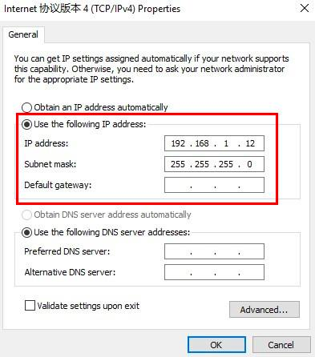

==========
Networking
==========

Connecting to the Controller with a Network Cable
-------------------------------------------------

DobotSCStudio can communicate with the controller directly through a network
cable.

**Procedure**

1.  Connect one end of the network cable to the LAN interface on the controller and the other end
    to the PC.
2.  Navigate to the **Control Panel** on your workstation and go to the **Network and Sharing
    Center**.
3.  Click **Local Area Connection** on the **Network and Sharing Center** page.
4.  Click **Properties**.
5.  Double click **Internet Protocol Verion 4 (TCP/IPv4)**.
6.  Select **Use the following IP address** and change the IP address and subnet mask of the PC.

    -   **IP address**: ``192.168.1.12``
    -   **Subnet mask**: ``255.255.255.0``

7.  Click **OK**.
8.  Click the dropdown arrow on the upper right of the DobotSCStudio and select **IP settings...**
9.  Set the controller's IP address to ``192.168.5.1`` and click **OK**.

.. image:: _images/scstudioipsetting.png
    :align: center

Connecting to the Controller over WiFi
--------------------------------------

**Procedure**

1.  Connect to the Dobot WiFi. It will start with ``Dobot_WIFI_``. The default WiFi password is
    ``1234567890``.
2.  Click the dropdown arrow on the upper right of the DobotSCStudio and select **IP settings...**
3.  Set the controller's IP address to ``192.168.1.6`` and click **OK**.

.. image:: _images/scstudioipsettingwifi.png
    :align: center

SSH into the Controller
--------------------------

Occasionally, you may need to SSH into your controller to edit configuration files, load
trajectories, etc.

**Procedure**

1.  Make sure your remote computer is connected to the cobot's network. You can verify this by
    opening a terminal (CMD, PowerShell, GNOME Terminal, etc.) and pinging the IP of the connection
    method you used.

    .. code-block:: console

        $ ping 192.168.1.6 # or 192.168.5.1 if using an Ethernet connection

2.  Run the ssh command to SSH into the controller's computer. The controller's username is
    ``root`` and the password is ``dobot``.

    .. code-block:: console

        $ ssh root@192.168.1.6 # or root@192.168.5.1 if using an Ethernet connection

3.  Your terminal will now open a shell on the controller's computer.

    .. code-block:: console

        [root /]$

